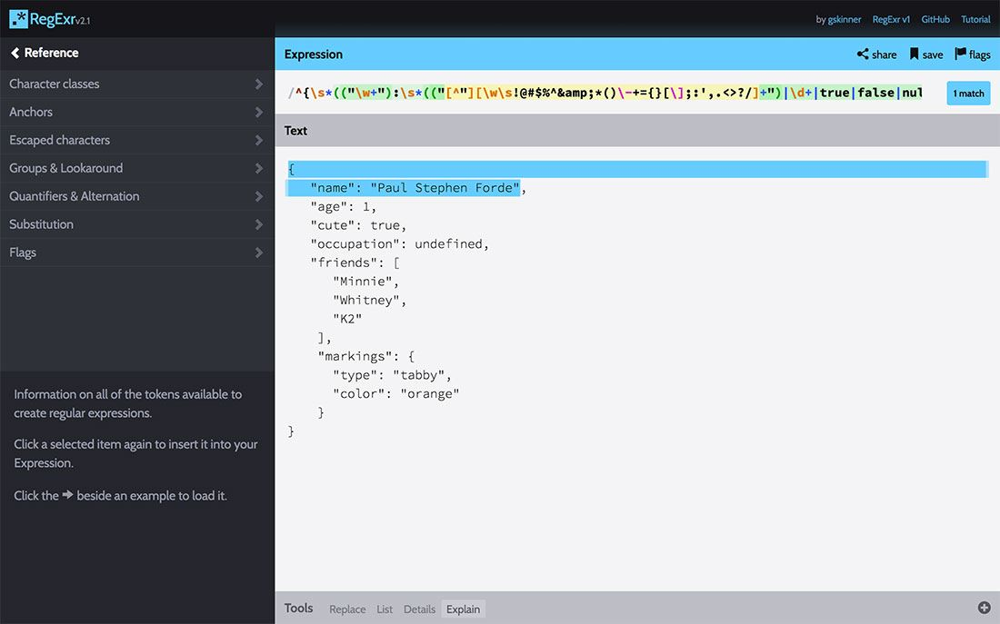
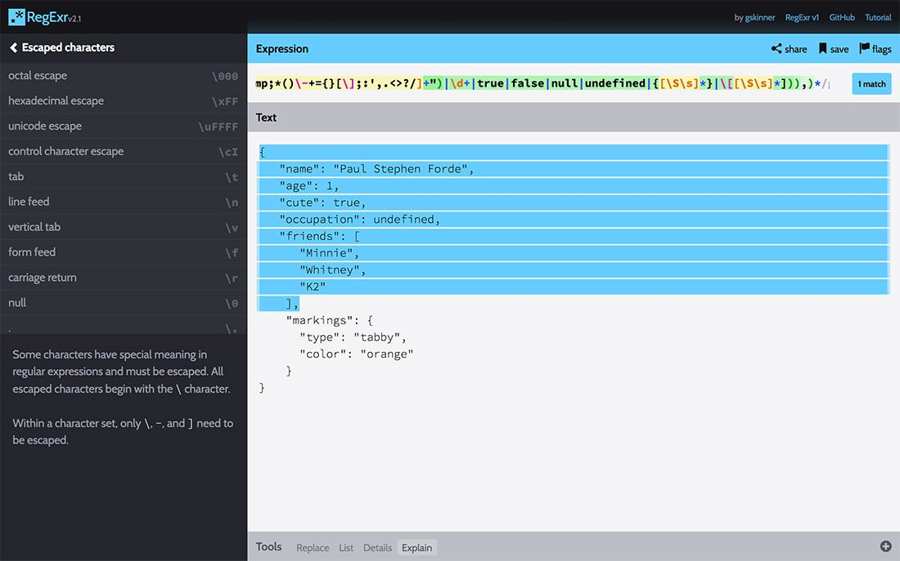
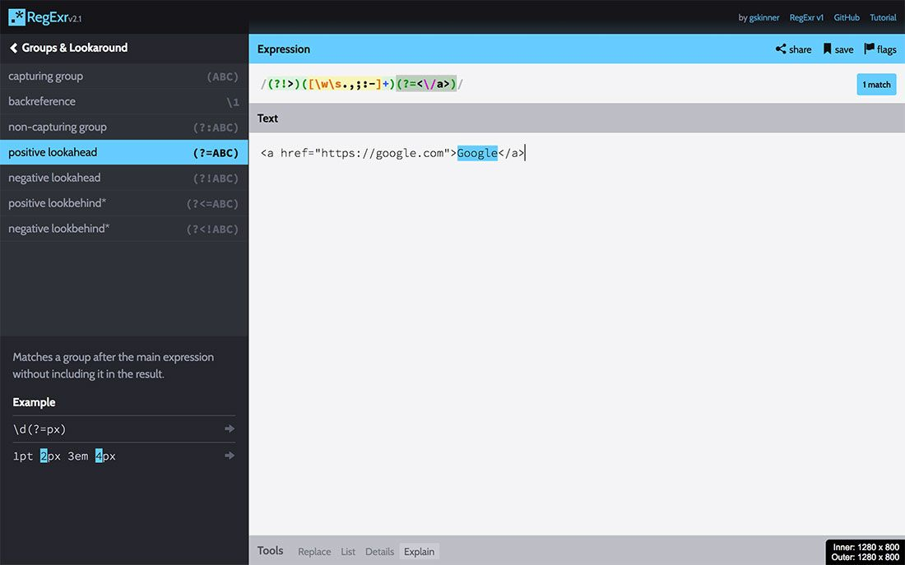

In the past week or so, I delved deeply into the terrifying world of regular expressions (regex). It turns out that regex isn’t that scary, and if you play with it enough, it is actually kinda…fun? My first foray into regex was when I was working through How to Learn JavaScript Properly. It was a great primer, but what I learned recently at Bov Academy has taken my understanding of regex to an entirely new, terrifying level.

In the course of learning regex, I had two projects to complete:

1. A simple JSON validator
2. A link harvesting utility

I thought it might be fun to share a little of what I learned about regex through these projects.

## Creating a simple JSON validator using regex

The first project I completed was a [simple JSON validator](https://carrieforde.github.io/bov-json-validator/). The gist is that the validator allows a user to either upload a JSON file, or paste their JSON data into a textarea. When the user clicks submit, the validator will use a regular expression to check whether the string is valid JSON. There are some caveats, however. This validator isn’t meant to check all JSON data, so mine will not correctly validate JSON arrays, but only JSON objects.

Because the regex portion of this assignment is what I really care about for this post, that is the only part I’ll cover. However, if you’re interested in the rest of the code, you can check out the Github repo.

### Defining valid JSON

The first step in working with any regex project is determining what qualifies as a valid match. In the case of JSON, here are the match parameters:

1. Starts with an opening curly brace
2. Keys must be wrapped in double quotes
3. Keys must be followed by a colon
4. Values may consist of these types:

   - Strings (wrapped in double quotes, but not containing double quotes)
   - Numbers
   - Boolean (true / false)
   - undefined
   - null
   - Objects
   - Arrays

5. When more than one key-value pair exists, the key-value pair must end with a comma
6. The final key-value pair must not have a comma at the end
7. The JSON object ends with a closing curly brace

With the valid JSON structure in mind, I created a simple, yet valid object to test against.

```js
{
  "name": "Paul Stephen Forde",
  "age": 1,
  "cute": true,
  "occupation": undefined,
  "friends": [
    "Minnie",
    "Whitney",
    "K2"
  ],
  "markings": {
    "type": "tabby",
    "color": "orange"
  }
}
```

Then I headed to the must-bookmark [RegExr site](https://regexr.com/) to start playing with my JSON regex.

### Capturing the opening curly brace

The first step is pretty easy–let’s make sure there is a match for the opening curly brace:

```js
var pattern = /^{/;
```

By tacking `^` onto the front of this regex, we’re making sure that our JSON object begins with that character. So whenever something **must begin** with a character, put a little hat on it (i.e. `^`) and party on. 🎉

### Identifying the keys to our JSON

Next, we’re going to check for some whitespace (anything like a space or a new line), and our key, which as mentioned above, must be wrapped in double quotes. Keys must also be followed by a colon, so we’ll check for that too.

```js
var pattern = /^{\s*("\w+"):/;
```

Let’s break this `\s*("\w+"):` section down a bit.

`\s*` is what we use to check for our optional whitespace. `\s` will search through our string and check for any whitespace character such as a space, tab, or new line. Adding `*` checks whether the proceeding character set (i.e. `\s`) exists zero or more times. That basically means that we’ll allow as much whitespace as the user wants, including no whitespace.

Parentheses in regex allows us to group a character / search set together. In the case of (`"\w+"`), I want to look for the JSON key which will have a opening `"` any combination of one or more word characters (`\w`, which is A through Z, 0 through 9 and the underscore), followed by a closing `"`. The `+` holds a magic power similar to `*`, but instead of zero or more, `+` requires at least one or more matches of the previous character set. After the key group, we simply add a `:` to ensure that is present before checking the value.

### Checking JSON values

Checking for valid values is where this regex starts looking gnarly because there are so many different types of values to check. At this stage, it’s best to break each possible value down into its own parts.

#### Starting with string values

We’ve already checked for strings in our key, so we can use that as a rough guide for checking valid string values. It does require modification, however, because a valid string could include a sentence with whitespace and punctuation. This updates our regex to look something like this:

```js
var pattern = /^{\s*("\w+"):\s*(("[^"][\w\s!@#$%^&*()\-+={}[\];:',.<>?/]+"))/;
```

Isn’t she a beaut? 💁‍♀️ Let’s go ahead and break down the `(("[^"][\w\s!@#$%^&\*()\-+={}[\];:',.<>?/]+"))` part.

I’m using two sets of parentheses for the capturing group because I’ll want to be able to check any of our valid values (i.e. more than just the string) and within that I want to check for a string group.

This string group starts with the double quote, then we hit this guy `[^"]`, which basically says, “hey double quotes, buzz off you’re not invited to this string party.” So any time you see a party hat within a set of square brackets, that there is a goddamn party pooper. 🙅‍♀️ But in all seriousness, `[^]` is a negation set, meaning that anything that comes after the party hat but before the closing square bracket will be excluded from set.

`[\w\s!@#$%^&*()\-+={}[\];:',.<>?/]+` is our heavily modified key check. And by heavily modified, I mean I added all this garbage: `\s!@#$%^&\*()\-+={}[\];:',.<>?/`. Adding that set of characters allows our string to contain whitespace, and a boatload of characters. One might be tempted to try `[\S\s]`, which allows for any characters, but that ends up allowing almost anything, and won’t return invalid should a double quote sneak its way into the mix. (Fun fact: I actually realized this bug in the process of writing this post.) By specifying exactly what we’re allowing, we can ensure that the regex doesn’t ignore our no double quotes within the string rule.

#### Numbers, truthy values, object and arrays, oh my!

Checking for strings as values is actually the most complicated part of the value regex because we need to specify what’s allowable within the string. Checking for the remaining valid values is actually relatively easy.

```js
var pattern = /^{\s*(("\w+"):\s*(("[^"][\w\s!@#\$%^&amp;_()\-+={}[\];:',.&lt;&gt;?/]+")|\d+|true|false|null|undefined|{[\S\s]_}|\[[\S\s]_]))_/;
```

That looks gnarly, but let’s break it down starting with `|\d+`. Whenever we encounter `\d` in regex, it means that we’re looking for any digit between 0 and 9. And you’ll remember when we add a `+`, it means we’re looking for one or more of a character group. So in this case, we’re looking for one or more digits. The pipe (`|`) that proceeds the `\d` is very similar to the `||` that we might see in JavaScript or PHP. Basically it says we want to match our string OR digits.

When we add `|true|false|null|undefined`, we know that we’re looking for a string OR a set of digits OR true OR false OR null OR undefined. We defined these values explicitly because they do not require double quotes like strings do.

Things get a little loosey goosey with the array and object checks, and this is why this is a simple validator. We use `{[\S\s]_}` to allow an object with any values within the object, and do something similar with our array check: `\[[\S\s]_]`. This means that we could get a valid result even though there may be invalid data within an object or array value. As I mentioned before, `[\S\s]` allows any characters, which includes A through Z, 0 through 9, punctuation, whitespace, etc. The `*` simply checks for zero or more occurrences of a character. And because square brackets are used to define character groups in regex, I had to escape the first bracket in the array check with a backslash: `\[`.

#### Capturing multiple key-value pairs

We’ve now defined parameters for keys and all allowable values. But if you plug this into RegExr using the sample valid object above, you’ll notice it only highlights the first line.



What we also notice is that the regex stops at the comma. It’s almost as simple as tacking on a comma at the end, but not quite. We need to add an opening parenthesis just after the opening curly brace for the entire regex, and we’ll add another closing parenthesis before the closing `/`. The comma will go between the final two closing parentheses. We’ll also add our handy zero or more `*` to allow for multiple key-value pairs. Now our regex is looking like this:

```js
var pattern = /^{(\s*(("\w+"):\s*(("[^"][\w\s!@#\$%^&_()\-+={}[\];:',.<>?/]+")|\d+|true|false|null|undefined|{[\S\s]_}|\[[\S\s]_])),)_/;
```

And now we have all but the last key-value pair and closing curly brace highlighted.



### Capturing the final key-value pair

Capturing that last key-value pair isn’t too complicated. We can simply copy the key-value portion of the regex and paste that after the final `_` in our existing regex. But this time, we need to remove the comma and that final `_`.

```js
var pattern = /^{(\s*(("\w+"):\s*(("[^"][\w\s!@#$%^&*()\-+={}[\];:',.<>?/]+")|\d+|true|false|null|undefined|{[\S\s]*}|\[[\S\s]*])),)*\s*(("\w+"):\s*(("[^"][\w\s!@#$%^&amp;_()\-+={}[\];:',.<>?/]+")|\d+|true|false|null|undefined|{[\S\s]_}|\[[\S\s]_])\s_)}$/;
```

I have also added the check for our closing curly brace, `}$`. The `$` indicates that the end of the string must be the curly brace. You may also notice that I added a `\s*` before the closing parenthesis to allow for any amount of whitespace before we hit the end of the JSON object.

### Checking invalid scenarios

The assignment provided an example of invalid data to help us on our way. It’s important to check for both valid and invalid scenarios to ensure that things are working correctly.

```js
{
  "country": "United States",
  "capital": "Washington, DC
  "states":{{}}
}
```

This scenario is great, but isn’t robust enough. We see that the closing double quote is missing for the capital value, but the comma is also missing. So to test this thoroughly, I’d make sure that we get no matches in the current case, when the ending double quote is present but the comma isn’t, and when the ending quote is missing, but the comma isn’t. I’d also dream up other scenarios to ensure that the validator passes simple tests. Trying a JSON object with just a single key-value pair might be a good test, for example.

Is this JSON validator perfect? Absolutely not, but it does a pretty decent job of at least making sure that all JSON object keys are wrapped in double quotes, and that most of our values are 100 percent correct (with the exception of what’s within an object or array, of course).

## Building a Link Harvester

The second regex-heavy assignment was to build a [link harvester](https://carrieforde.github.io/bov-link-harvester/). The link harvester allows a user to upload an HTML file, or paste the contents of an HTML file into a text area. Upon submitting the data, the harvester outputs all the external links and emails addresses along with their corresponding text.

Again, I’m going to focus on the regex for this post, but if you’re interested in a deeper dive, you can [find the repo on Github](https://github.com/carrieforde/bov-link-harvester).

### Defining valid link scenarios

As with the JSON validator, the first thing to do was identify what qualified as a valid match. In this case, I was looking for external links and email addresses. I wanted to exclude links within a site, so I’d keep that in the back of my mind when testing various scenarios.

### Harvest all the links

I took a few stabs at different ways of identifying links before arriving at my final regex. I knew that a link needed to be wrapped in an a tag, and I knew that external links could start with http or https. Email addresses on the other hand could start with `mailto`. But what I decided after a few different attempts is that the first pass for harvesting links shouldn’t care what type of link existed, it should just focus on capturing anything wrapped in an a tag. So this is my initial regex:

```js
var pattern = /(<a[\s\w="?:/.@-]_>)([\w\s.,;:-])+<\/a>/gi;
```

Let’s split this up into the three main parts, starting with `(<a[\s\w="?:/.@#-]_>)`. We’ve got this whole thing wrapped in parentheses, so we know this is a capturing group. Within the capturing group, we want to find the opening portion of our `a` tag `<a`. We’re going to follow that with optional whitespace, word characters, and a few additional characters we may find in class names, urls, etc. `[\s\w="?:/.@#-]*` gives us the most flexibility in harvesting the opening a tag without worrying about whether a link contains just an href, a class, an id, or any other combination of attributes. As we did several times in the JSON validator, we add a `*` to allow for zero or more instances of that character set. Then we’ll look for our closing angle bracket.

The next capturing group, `[\s\w="?:/.@#-]*` will capture our link’s text. The link text may contain whitespace, word characters and a few additional punctuation characters (I didn’t go overboard here, so it’s entirely possible it may not harvest a link it should).

The final part is simply the closing `</a>` for our link tag. I’m tempted to make an anchor joke here, but I think I’ll just keep going… ⚓️

### Weeding out the non-matches

I used the match method to store the links as an array to my links variable. The next job is to loop through all those links, identify which ones are external links and email addresses.

```js
// Pull out the external links & email addresses.
links.forEach(function(link) {
  var address = link.match(/((https\*:\/\/)[\w=?:/.@-]+)|(mailto:[\w@.-]+)/gi),
    text = link.match(/(?!>)([\w\s.,;:-]+)(?=<\/a>)/gi);

  // If after applying our second-layer regex, if empty, bail.
  if (!address) {
    return;
  }

  // Push links into our harvested object's links array.
  if (address[0].match(/((https*:\/\/)[\w=?:/.@-]+)/gi)) {
    var obj = {
      url: address[0],
      text: text[0]
    };

    harvested.links.push(obj);
  }

  // Push email addresses into our harvested object's email array.
  if (address[0].match(/(mailto:[\w@.-]+)/gi)) {
    harvested.emailAddresses.push(address[0]);
  }
});
```

You’ll notice that `address` is doing a further check on the current iteration of the link array, `var address = link.match(/((https*:\/\/)[\w=?:/.@-]+)|(mailto:[\w@.-]+)/gi)`. Were checking for whether the link begins with `http`. By adding `s*`, we can add an optional check for an `s` which will also pass our `https` check. Then we make sure that is followed by a colon and two forward slashes (which have been escaped). The url itself can contain any combination of word characters, and a select few punctuation characters. Unfortunately, I don’t think this necessarily captures all link scenarios, but I was able to capture fairly common scenarios in my testing.

Since we want to grab email addresses, we have a `|` and a second capturing group to check for `mailto:`. I figured there are fewer allowable characters in email addresses, so limited it to word characters, the `@`, `.`, and the dash. You’ll note that there is a `gi` at the end of all regex in this link harvester example. The `g` flag is what allows us to capture more than one match, and the `i` flag ignores the character case, so we can match both upper and lowercase characters.

### The magic of positive and negative lookaheads

The trickiest bit here wasn’t identifying potential links for harvesting, but trying to figure out how to capture just the text between an opening and closing a tag. Sure, I could have used some `substring()` voodoo, but why not put regex to the test here too?

You’ll notice the text variable’s regex has some weird extra characters in it, namely `(?!>)` and `(?=<\/a>)`. We’ve already discussed that parentheses are used for capturing groups, and the same is true in both these instances. Adding `?!`, known as a negative lookahead, to the first capturing group, however, tells our regex to look for the closing angle bracket of our opening a tag, but doesn’t actually include it on our match. We need the second part, our positive lookahead `?=`, to tell our regex to keep looking until you find this closing a tag, but again, don’t actually include the `</a>` itself in our results. Basically, the combination of a negative and positive lookahead is creating a boundary for our text regex, and returns only the link text value. Pretty neat, huh? RegExr illustrates this really well:



The rest of the `forEach` pushes our set of external websites and email addresses to an object, which is rendered to the screen by a separate function.

There is no denying that regex is still tricky, but I’ve been finding it a fun challenge to figure out these types of problems. Clearly, regex is not necessarily easy for everyone to understand, and many consider it an anti-pattern for that reason. So, if there is an easier way to accomplish something without regex, that would be the preferred route. But if you absolutely need to use a regex, hopefully this post has cleared up some confusion or offered you some ideas to solving your regex quandary. 😃
