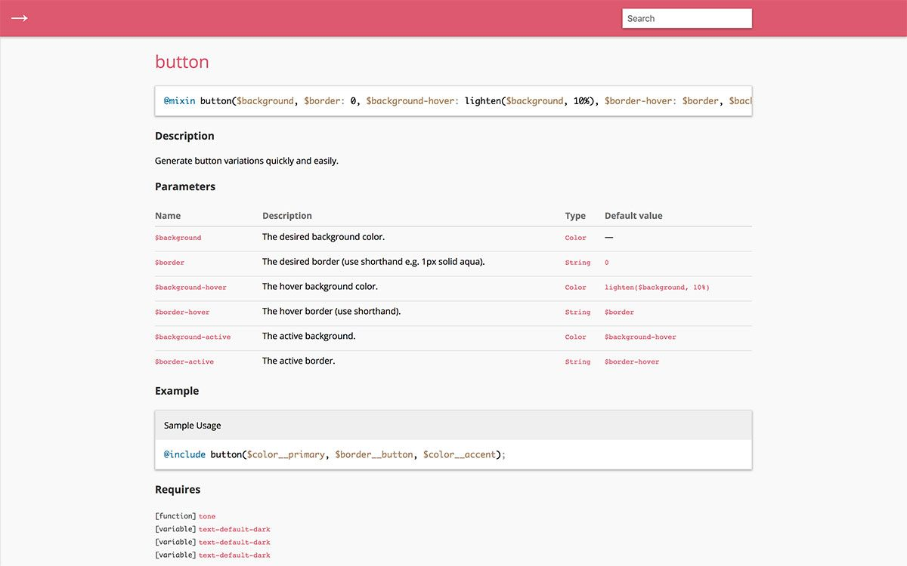

Now that Aurora Theme has a [solid foundation built upon Underscores](), it’s time to make it a React-ready project. To speed up this process, I am going to integrate [Aurora Project](https://github.com/carrieforde/Aurora-Project), a project boilerplate, into Aurora Theme. Today I’ll discuss a few key features of Aurora Core, the problem it’s meant to solve, and a little about how I’ve built it. In future posts, I’ll talk about how it’ll be integrated into Aurora Theme, and the key differences between Aurora Core and Aurora Theme.

## The problem

After building several dozen projects for Bov Academy, I realized most projects had a common set of requirements / tooling. Unless a project requires 200 lines of CSS or less, I always reach for Sass, and I needed a way to compile my styles.

I always use JavaScript in all my Bov Academy projects, and typically, I’d have more than one file to deal with. Keeping performance and ease in mind, I needed a way to concatenate and minify to JS, too.

Additionally, I have a preferred structure for each of my projects. HTML files tend to stay at the top level, while Sass, JavaScript, images, and other assets live in an assets/ directory. Why recreate the structural wheel for each project, right?

My first attempts at rolling my Sass and JavaScript requirements together was within my [Bov Web Components](https://github.com/carrieforde/Aurora-Components) project. I set up my desired project structure and added a pretty sweet Gruntfile for all sorts of tasks. And it worked pretty decently. Except not all projects require accordions or tabs or [insert other component here]. And ain’t nobody go time for ripping all that junk out at the start of a project (because we all know if you wait to the end, that ish is shipping ?). After ripping out the same components for the forth or fifth time, I decided it was time to consider building a proper boilerplate.

What makes a good project boilerplate?
The structural and Grunt task running features of Bov Web Components were infinitely useful. Other features, mainly the components themselves, were less so. I wanted to use what worked as a starting point, and expand upon that. So I created a little list of requirements for my boilerplate:

- Sass support
  - functions
  - mixins
  - a base config file
- JavaScript / ES Next
  - Task running
  - Sass compilation & minification
  - JavaScript concatenation & minification
  - Image processing (compression)
  - Icon concatenation & minification
- Linting
  - Stylelint
  - ES Lint
  - Configuration
  - Editor Config
  - Prettier
  - Babel
- Documentation
  - Sassdoc
  - JS Doc
  - KSS

Once the initial requirements were defined, I started really digging into research. Mina Markham’s [Sassy Starter](https://github.com/minamarkham/sassy-starter) provided a lot of inspiration, as did fellow Bov Student Gabriele Romero’s [ES6 Professional Starter Kit](https://github.com/GabrieleRomeo/ES6-Professional-starter-kit). Both are clean slates for a new project, and both are documentation-forward. Sassy Starter has incredibly well documented Sass functions and mixins using Sassdoc, while Gabriel’s ES6 starter kit has JavaScript documentation in mind with JS Doc integration.

I cannot express enough how important this type of documentation is. Have you ever used [MDN](https://developer.mozilla.org/en-US/) or the [jQuery API docs](http://api.jquery.com/)? Both have rich documentation available for both Sass and JavaScript was really important to me since Aurora Core is an open source project. I want anyone who comes across the boilerplate to feel confident that they can download it and get started with no problems.

To round out my research, I looked to the more popular feature-rich front end frameworks like Bootstrap and Foundation. I wanted to get a sense of what was included beyond a bunch of predefined components (i.e. were there any useful Sass functions or mixins I could replicate). I noted anything that looked interesting in Evernote, and found a few other resources along the way.

With a clear list of requirements, and a bunch of helpful notes research notes, I set to work on the boilerplate.

## Laying the foundation

Bov Web Components was a great starting point for this project. In fact, I actually grabbed all the configuration files (Prettier, ESLint, Stylelint, etc.) and the Gruntfile from that project to start Aurora. Around the time I started Aurora Core, I read about [Readme Driven Development (RDD)](http://tom.preston-werner.com/2010/08/23/readme-driven-development.html). RDD claims to be a happy medium between a waterfall process, where projects are outlined in too much painstaking detail, and agile development where projects aren’t defined in enough detail. While I didn’t write my readme from the very start, I did set to work on it in the first day. Having a project charter has, indeed, been hugely beneficial to keeping my on task.

After the initial project setup, I focused on creating my foundational Sass files. I made detailed lists of must-have functions, mixins, and variables, trolled through old projects for more ideas, and added ideas based on my research. Even though I adore Sass, this part was painstaking. Remember when I mentioned documentation being important? Well, it’s also a PITA to write. It’s especially painful for mixins. Feast your eyes on this as an example:

```scss
/// Generate button variations quickly and easily.
///
/// @param {Color} $background                                    - The desired background color.
/// @param {String} $border [0] - The desired border (use shorthand e.g. 1px solid aqua).
/// @param {Color} $background-hover  [lighten($background, 10%)] - The hover background color.
/// @param {String} $border-hover      [$border] - The hover border (use shorthand).
/// @param {Color} $background-active [$background-hover] - The active background.
/// @param {String} $border-active     [$border-hover] - The active border.
///
/// @example - scss Sample Usage
/// @include button($color__primary, $border**button, \$color**accent);
///
/// @todo Determine whether color should be passed, or add way to automatically determine color to use (light or dark).
@mixin button(
  $background,
  $border: 0,
  $background-hover: lighten($background, 10%),
  $border-hover: $border,
  $background-active: $background-hover,
  $border-active: $border-hover
) {
  background-color: $background;
  border: $border;
  color: \$text-default-dark;

  &:focus,
  &:hover {
    background-color: $background-hover;
    border: $border-hover;
    color: \$text-default-dark;
  }

  &:disabled {
    background-color: tone(\$background, 20%);
  }

  &:active {
    background-color: $background-active;
    border: $border-active;
    color: \$text-default-dark;
  }
}
```

There is nearly as much / more documentation for this mixin as there is code! But it sure is helpful to have documentation to which I can refer later.



## Introducing Webpack

Grunt is great. It’s familiar, but it is also slow AF. I heard all the kids these days are using Webpack, and as soon as I had an opportunity to learn it, I wanted to integrate it into Aurora Core.

One of the most common conceptions of Webpack is that it’s difficult to learn. And it kind of is. But while it’s not as easy or familiar as Grunt or Gulp, it’s not super duper difficult either. Once you wrap your head around loaders and plugins, you’re golden.

But where Webpack really shines is in it’s ability to play super nicely with not only ES6+ JavaScript, but also with front end frameworks including Vue and React. While Aurora Core’s charter is to be ES6+ ready, I also wanted to make it really easy to integrate JavaScript frameworks.

So not too long after learning Webpack, I set to work researching loaders, plugins, and doing a bunch of trial and error to see what worked, and what didn’t. I’ll readily admit I have started it over once or twice already. But I’m feeling much better about where it is currently. I still need to add a few things specifically for production builds, but once that’s done, it’ll be good to go.

This is so much already, and I haven’t even touched on how Aurora Core will be integrated into Aurora Theme. ? In the next post, I’ll talk about adding Aurora Core to Aurora Theme. I’ll talk about preparing the theme for React, and on the differences between how Webpack works within Core vs. the Theme. After that, I’ll talk about how I’m using Aurora Core’s Sass in the Theme. There are some rad benefits of Sass + Webpack + React that I cannot wait to share. And last in this micro series on Aurora Core, I’ll review how I am using code formatting and linting tools, and the differences in them between Core and the Theme.
