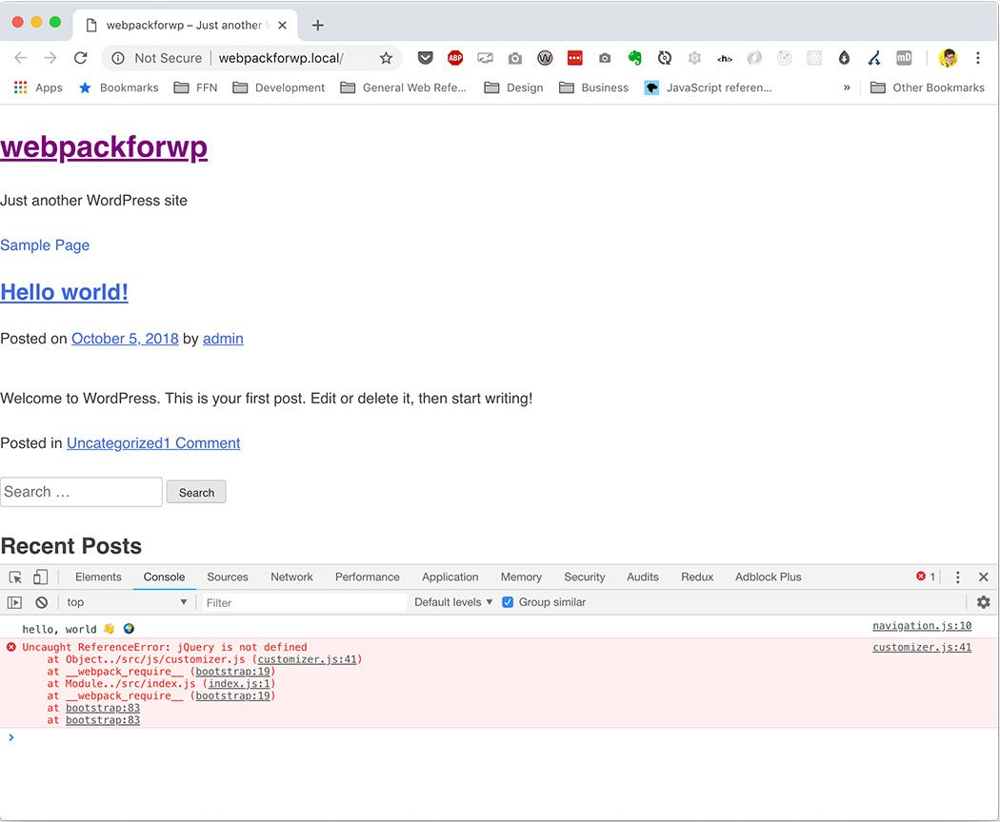
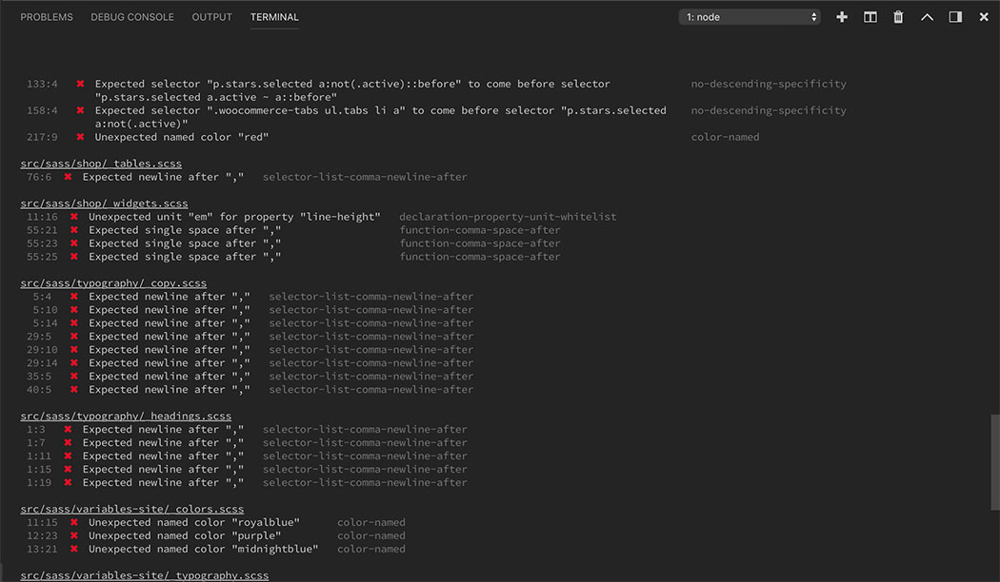

<CallOut type="info">
  If you're looking for a fully-fleshed out version of <code>_s</code> with
  webpack, check out the{" "}
  <a href="https://github.com/carrieforde/_s-with-webpack">_s-with-webpack</a>{" "}
  repo.
</CallOut>

In this post, I’ll cover webpack at a high level (what it is, and why we might reach for it), and show you how you can unleash the power of webpack in your WordPress projects to manage and bundle front end assets.

At first glance, it’s really tempting to classify webpack as yet another front end task runner. Not unlike Grunt or Gulp, it can perform tasks such as JavaScript and Sass compilation and minification. But the way in which webpack works with these files is what makes webpack stand out.

When you run webpack within your project, it looks through the project for the types of files you asked it to process. This could include JavaScript, styles (e.g. CSS / Sass), icons (svg), images, etc. When webpack processes these files, it looks through the code and bundles only what is used in the source code. In webpack, this is known as the dependency graph. The result of the dependency graph is that your final bundle only includes the files required for your application, and nothing more.

## Getting started with webpack

The main requirements for getting started with webpack include:

- **Node & NPM**  
   Follow the instructions for installing Node on the Node site (or if you’re on a Mac, it’s super easy to manage with brew). NPM comes bundled with Node, but understanding the Node package ecosystem is helpful.
- **A little JavaScript knowledge**  
   Webpack is JavaScript-driven, and understanding JS basics will make working with weback easier.
- **Patience**  
  The webpack ecosystem takes some time to wrap one’s head around. Research and experimentation will serve you well in your journey to learn webpack.

## Creating a webpack file for a WordPress theme

For the demo portion of this post, I’ll be taking you through the process of adding webpack support to \_s. If you’d like to code along, go ahead and clone the repo locally and checkout the webpack-start branch. To save time and headache, all the required npm packages are listed in package.json so you will only need to install them.

```bash
git clone https://github.com/carrieforde/_s-with-webpack.git _s
git checkout -b webpack-start origin/webpack-start
cd _s
npm install
```

Side note: the above assumes you already have a local WordPress development environment set up. If you’re not familiar with local WordPress development, I highly suggest checking out Local by Flywheel.

Before we get into the nitty gritty of setting up webpack for \_s, let’s talk a little about what would be useful:

- **JavaScript compilation**  
   There are a handful of JavaScript files in the theme, and as we build out projects on \_s, it would be nice to have a way to easily concatenate and bundle our JavaScript files.
- **Sass compilation**  
   \_s comes with Sass, so including functionality to bundle our stylesheet(s) would be really helpful.
- **Code Sniffing / Linting**  
   Since \_s already ships with phpcs.xml.dist, a configuration file for PHP code sniffing, let’s go ahead and include code sniffing / linting for our Sass and JavaScript code according to the WordPress Coding Standards.
- **Browser reloading**  
   During development, it’s super helpful to immediately see our changes in the browser. We’ll use BrowserSync to reload our local site in the browser every time we save changes in within the theme.
- **Icon & image management**  
   Finally, it would be a good idea to have a way to manage icons and images used within the theme. For this, we’ll add some functionality to bundle, concatenate, and minify our SVG and image files.

### Basic webpack setup

Technically speaking, webpack 4 doesn’t actually require any sort of configuration file. webpack will automatically look for `src/index.js` as your application’s entry point. Running `node_modules/.bin/webpack` (or simply, `webpack`, if you have it installed globally on your machine) within your `_s` repo, will then produce `dist/main.js`.

And this is pretty great if you only need to deal with JavaScript. In fact, you could easily build an entire JavaScript or React application without any additional configuration. But that’s not how the real world of front end development works, and we’ll want to have a bit more control over our setup.

Go ahead and open up webpack.config.js within the `_s` directory. The first thing we’re going to do is declare a variable at the top of the file:

```javascript
const path = require("path");
```

[`path`](https://nodejs.org/api/path.html) is a built in Node module, that will allow us to declare relative paths to files throughout `_s`, and prevent any clashes with paths in our operating system. During this tutorial, you’ll often see path used with the [`__dirname`](https://nodejs.org/docs/latest/api/globals.html#globals_dirname) global.

Next, let’s start building our configuration object. Since webpack works in a Node environment, we’ll assign our configuration object to module.exports. According to [TutorialsTeacher.com](http://www.tutorialsteacher.com/nodejs/nodejs-module-exports),

> `module` is a variable that represents current module and exports is an object that will be exposed as a module. So, whatever you assign to `module.exports` or `exports`, will be exposed as a `module`.

Within our configuration object let’s declare the entry and output properties.

```javascript
module.exports = {
  context: __dirname,
  entry: "./src/index.js",
  output: {
    path: path.resolve(__dirname, "public"),
    filename: "bundle.js",
  },
};
```

- **`context`** is an absolute path to your application so webpack always knows where to run. It’s not strictly required, but means that you can run webpack from anywhere in your app without issue.
- **`entry`** defines the starting point of our application. The content of your entry file may vary greatly. It may be used to import other JavaScript files using ES6 import, or may even be a regular JS file.
- **`output`** specifies the file(s) generated by the application.
- **`path`** defines the directory in which we’ll find our bundled assets.
- **`filename`** is the name of the JavaScript file generated by the application.

Now that we’ve defined our basic configuration, let’s open index.js and import the files in our js directory using the import statement.

```javascript
import "./js/customizer";
import "./js/navigation";
import "./js/skip-link-focus-fix";
```

Go ahead and entry `node_modules/.bin/webpack` in your terminal (within the `_s` directory), and you should see a minified file in the public directory that looks something like this:

```javascript
!function(e){var t={};function n(i){if(t[i])return t[i].exports;var a=t[i]={i:i,l:!1,exports:{}};return e[i].call(a.exports,a,a.exports,n),a.l=!0,a.exports}n.m=e,n.c=t,n.d=function(e,t,i){n.o(e,t)||Object.defineProperty(e,t,{enumerable:!0,get:i})},n.r=function(e){"undefined"!=typeof Symbol&&Symbol.toStringTag&&Object.defineProperty(e,Symbol.toStringTag,{value:"Module"}),Object.defineProperty(e,"**esModule",{value:!0})},n.t=function(e,t){if(1&t&&(e=n(e)),8&t)return e;if(4&t&&"object"==typeof e&&e&&e.**esModule)return e;var i=Object.create(null);if(n.r(i),Object.defineProperty(i,"default",{enumerable:!0,value:e}),2&t&&"string"!=typeof e)for(var a in e)n.d(i,a,function(t){return e[t]}.bind(null,a));return i},n.n=function(e){var t=e&&e.\__esModule?function(){return e.default}:function(){return e};return n.d(t,"a",t),t},n.o=function(e,t){return Object.prototype.hasOwnProperty.call(e,t)},n.p="",n(n.s=0)}([function(e,t,n){"use strict";n.r(t);n(1),n(2),n(3)},function(e,t){!function(e){wp.customize("blogname",function(t){t.bind(function(t){e(".site-title a").text(t)})}),wp.customize("blogdescription",function(t){t.bind(function(t){e(".site-description").text(t)})}),wp.customize("header_textcolor",function(t){t.bind(function(t){"blank"===t?e(".site-title, .site-description").css({clip:"rect(1px, 1px, 1px, 1px)",position:"absolute"}):(e(".site-title, .site-description").css({clip:"auto",position:"relative"}),e(".site-title a, .site-description").css({color:t}))})})}(jQuery)},function(e,t){!function(){var e,t,n,i,a,o;if((e=document.getElementById("site-navigation"))&&void 0!==(t=e.getElementsByTagName("button")[0]))if(void 0!==(n=e.getElementsByTagName("ul")[0])){for(n.setAttribute("aria-expanded","false"),-1===n.className.indexOf("nav-menu")&&(n.className+=" nav-menu"),t.onclick=function(){-1!==e.className.indexOf("toggled")?(e.className=e.className.replace(" toggled",""),t.setAttribute("aria-expanded","false"),n.setAttribute("aria-expanded","false")):(e.className+=" toggled",t.setAttribute("aria-expanded","true"),n.setAttribute("aria-expanded","true"))},a=0,o=(i=n.getElementsByTagName("a")).length;a<o;a++)i[a].addEventListener("focus",s,!0),i[a].addEventListener("blur",s,!0);!function(e){var t,n,i=e.querySelectorAll(".menu-item-has-children > a, .page_item_has_children > a");if("ontouchstart"in window)for(t=function(e){var t,n=this.parentNode;if(n.classList.contains("focus"))n.classList.remove("focus");else{for(e.preventDefault(),t=0;t<n.parentNode.children.length;++t)n!==n.parentNode.children[t]&&n.parentNode.children[t].classList.remove("focus");n.classList.add("focus")}},n=0;n<i.length;++n)i[n].addEventListener("touchstart",t,!1)}(e)}else t.style.display="none";function s(){for(var e=this;-1===e.className.indexOf("nav-menu");)"li"===e.tagName.toLowerCase()&&(-1!==e.className.indexOf("focus")?e.className=e.className.replace(" focus",""):e.className+=" focus"),e=e.parentElement}}()},function(e,t){/(trident|msie)/i.test(navigator.userAgent)&&document.getElementById&&window.addEventListener&&window.addEventListener("hashchange",function(){var e,t=location.hash.substring(1);/^[A-z0-9_-]+$/.test(t)&&(e=document.getElementById(t))&&(/^(?:a|select|input|button|textarea)$/i.test(e.tagName)||(e.tabIndex=-1),e.focus())},!1)}]);
```

### Setting up development modes

The `bundle.js` file above is a bit gnarly, right? By default, wepack runs in production mode. This means that every time we run webpack our files are not only bundled, but they’re also minified.

Minification is the process of stripping out whitespace, and replacing other unneeded characters in our source code. So, for example, instead of seeing variables with sensible names in our code, like container, we see e. And while minification is great for production ready code, it’s not so great during development. Let’s update our config to run in development mode by default instead.

```javascript
module.exports = {
  context: __dirname,
  entry: "./src/index.js",
  output: {
    path: path.resolve(__dirname, "public"),
    filename: "bundle.js",
  },
  mode: "development",
};
```

In the code above, you’ll see I added the `mode` property. Since webpack defaults to production, I set it to development. Now when you run `node_modules/.bin/webpack` in your project, you’ll see a verbose, human-readable file.

We can enhance this a step further, however. Let’s say we had a bug in our `navigation.js`. If an error is thrown in the developer console of our browser, it’s going to point to a line in bundle.js, not our navigation.js. And while it’s true that in development mode, our file is more human readable, I don’t think anyone wants to waste their time tracking down a bug in one file just to find fix it in another. That’s where source maps come to the rescue.

A source map helps map the code we write in our files, to what is read by the browser (i.e. `bundle.js`). Now, if I leave a `console.log()` statement on line 10 of `navigation.js`, I’ll be able to see that in my developer tools.

Source maps are added using the devtool property:

```javascript
module.exports = {
  context: __dirname,
  entry: "./src/index.js",
  output: {
    path: path.resolve(__dirname, "public"),
    filename: "bundle.js",
  },
  mode: "development",
  devtool: "source-map",
};
```

`source-map` is one among a wide variety of source map options for the `devtool` property. I recommend reviewing the [webpack documentation on `devtool`](https://webpack.js.org/configuration/devtool/) to learn more about your options.

Now that we have the basics of our webpack config laid out. let’s try running `node_modules/.bin/webpack` again. If everything worked correctly, we should see a human-readable `bundle.js`, and if we have errors or `console.log()` statements, we’ll see where they are in our source code.



The developer tools show that I have a `console.log()` statement on line 10 of `navigation.js`, and a problem with jQuery in `customizer.js`.

#### Adding Node scripts

Typing `node_modules/.bin/webpack` or `webpack` every time we want to bundle our files is a little tiresome. Let’s go ahead and open up our `package.json` file and add a few scripts that will help automate our webpack processes.

Within the `"scripts"` object of `package.json`, add `"dev": "webpack --watch"`. Now, you can type `npm run dev` in your terminal, and every time you save a `index.js` or one of the files in the js directory, webpack will automatically rebundle.

And since we turned production mode off by default, it would be good to add a script that will bundle our files for production (including minification). Let’s also add `"build": "webpack --mode=production"` to our script object, which will not only bundle our code, but it will also minify it.

Go ahead and run `npm run build` and have a peek at your bundle.js file to ensure that you have a minified file, and that it’s working as expected.

Your final "scripts" object should look something like this:

```JSON
{
  "scripts": {
    "build": "webpack --mode=production",
    "dev": "webpack --watch",
    "eslint": "eslint \"src/**/*.{js,jsx}\" --quiet",
    "eslint:fix": "eslint \"src/**/_.{js,jsx}\" --quiet --fix",
    "format": "prettier --write \"src/**/_.{js,jsx,scss}\"",
    "stylelint": "stylelint \"src/**/*.{css,scss}\"",
    "stylelint:fix": "stylelint \"src/**/_.{css,scss}\" --fix",
    "wp-pot": "wp-pot --src '_.php' --dest-file 'languages/_s.pot' --domain '_s'"
  }
}
```

We can’t use `npm run dev` while updating `webpack.config.js`. You’ll have to either stop then restart the dev script after you’ve made a change, or continue typing our `node_modules/.bin/webpack` or webpack until your configuration is complete.

### Loaders

Now that we have our webpack config set up to bundle JavaScript files, let’s talk about **loaders**. As we’ve discovered so far, webpack is able to understand and process JavaScript files by default. But even this handling of JavaScript files is limited to compilation and minification. Let’s say you are using the latest and greatest in JS, for example, ES2019. As developers, we know it takes time for new features to be available in all browsers, and we’ll typically need some way of transpiling, or converting, our modernized code into a version understandable by older browsers (e.g. ES6 into ES5).

**Loaders** help extend the functionality of webpack to allow it to further process JS files (e.g. using Babel for transpilation), or to process other types of files (e.g. Sass, images, etc.), which are converted into other modules needed by our application. Loaders are the secret 🗝to wepack’s magic. ✨

Let’s first take a look at using the Babel loader to help us transpile our ES Next code into something that browsers down to IE11 will be able to understand. You’ll see I have included a Babel configuration file within the project that looks like this:

```javascript
{
    "presets": [
        [
            "@babel/env",
            {
                "targets": {
                    "browsers": ["last 2 versions"]
                }
            }
        ]
    ]
}
```

Without going too deep in the weeds, the basic idea here is that Babel will look through the source code we create, and during the transpilation process, will turn our JavaScript into code supported by the last two versions of all the major browsers (including IE11). But before this actually happens, we need to set up our babel-loader in the webpack config.

Loaders live within a `rules` array that is nested within a module object. Each loader is an object that consists of a test property, which determines which files will be targeted for the transform, and a loader property, which tells webpack which loader to use for the actual transformation. Here’s our webpack file with the Babel loader:

```javascript
const path = require("path");

module.exports = {
  context: __dirname,
  entry: "./src/index.js",
  output: {
    path: path.resolve(__dirname, "public"),
    filename: "bundle.js",
  },
  mode: "development",
  devtool: "cheap-eval-source-map",
  module: {
    rules: [
      {
        test: /\.jsx?$/,
        loader: "babel-loader",
      },
    ],
  },
};
```

Let’s take a closer look at the object for Babel:

```javascript
{
test: /\.jsx?$/,
  loader: 'babel-loader'
}
```

- **`test`** uses a regular expression to match files ending in either `.js` or `.jsx`. In this expression, `?` means that the proceeding character (the x) is optional, and `$` means that the file we’re evaluating should end with this string.
- **`loader`** tells webpack to use `babel-loader` to perform the transformation.

If you want to learn more about regular expressions, I wrote a lengthy post about using [regex to create a basic JSON validator and a link harvester](https://carrieforde.com/regex-revisited).

We can test that our new rule is working by refactoring navigation.js to use ES6 features including const, let, arrow functions, and forof loops:

```javascript
/**
 * File navigation.js.
 *
 * Handles toggling the navigation menu for small screens and enables TAB key navigation support for dropdown menus.
 */
(function () {
  let container, button, menu, links, i, len;

  container = document.getElementById("site-navigation");

  if (!container) {
    return;
  }

  button = container.querySelector("button"); // querySelector will automatically return the first match.
  if ("undefined" === typeof button) {
    return;
  }

  menu = container.querySelector("ul");

  // Hide menu toggle button if menu is empty and return early.
  if ("undefined" === typeof menu) {
    button.style.display = "none";
    return;
  }

  menu.setAttribute("aria-expanded", "false");
  if (!menu.classList.contains("nav-menu")) {
    menu.classList.add("nav-menu");
  }

  button.onclick = () => {
    if (container.classList.contains("toggled")) {
      container.classList.remove("toggled");
      button.setAttribute("aria-expanded", "false");
      menu.setAttribute("aria-expanded", "false");
    } else {
      container.classList.add("toggled");
      button.setAttribute("aria-expanded", "true");
      menu.setAttribute("aria-expanded", "true");
    }
  };

  // Get all the link elements within the menu.
  links = menu.querySelectorAll("a");

  // Each time a menu link is focused or blurred, toggle focus.
  for (const link of links) {
    link.addEventListener("focus", toggleFocus, true);
    link.addEventListener("blur", toggleFocus, true);
  }

  /**
   * Sets or removes .focus class on an element.
   */
  function toggleFocus() {
    const self = this;

    // Move up through the ancestors of the current link until we hit .nav-menu.
    while (!self.classList.contains("nav-menu")) {
      // On li elements toggle the class .focus.
      if ("LI" === self.tagName) {
        if (self.classList.contains("focus")) {
          self.classList.remove("focus");
        } else {
          self.classList.add("focus");
        }
      }

      self = self.parentElement;
    }
  }

  /**
   * Toggles `focus` class to allow submenu access on tablets.
   */
  (function (container) {
    const parentLink = container.querySelectorAll(
      ".menu-item-has-children > a, .page_item_has_children > a"
    );
    let touchStartFn, i;

    if ("ontouchstart" in window) {
      touchStartFn = (e) => {
        const menuItem = this.parentNode;
        let i;

        if (!menuItem.classList.contains("focus")) {
          e.preventDefault();
          for (i = 0; i < menuItem.parentNode.children.length; ++i) {
            if (menuItem === menuItem.parentNode.children[i]) {
              continue;
            }
            menuItem.parentNode.children[i].classList.remove("focus");
          }
          menuItem.classList.add("focus");
        } else {
          menuItem.classList.remove("focus");
        }
      };

      for (const child of parentLink) {
        child.addEventListener("touchstart", touchStartFn, false);
      }
    }
  })(container);
})();
```

Now after running `npm run dev`, we see that the arrow function has been transformed into a regular function, the `forof` loop became a standard for loop, and usage of `let` and `const` has been transformed into `var`.


The arrow function is now a standard function, and the `forof` was transformed into a `for` loop.

We can enhance our JavaScript processing a bit further by adding the eslint-loader to lint our files, and print errors in the console as we save.

```javascript
const path = require("path");

module.exports = {
  context: __dirname,
  entry: "./src/index.js",
  output: {
    path: path.resolve(__dirname, "public"),
    filename: "bundle.js",
  },
  mode: "development",
  devtool: "cheap-eval-source-map",
  module: {
    rules: [
      {
        enforce: "pre",
        exclude: /node_modules/,
        test: /\.jsx$/,
        loader: "eslint-loader",
      },
      {
        test: /\.jsx?$/,
        loader: "babel-loader",
      },
    ],
  },
};
```

#### Going beyond JavaScript

As I alluded earlier, loaders enable us to work with more than just JavaScript. And even though `_s` ships with [optional] Sass, it doesn’t ship with a way to compile that Sass. Let’s set up some loaders that will help us compile styles.

Processing Sass with webpack is a bit more complex than working with JavaScript, and we’ll need more than one loader to get our Sass to compile to a usable format.

Let’s start by adding this object below our babel-loader object:

```javascript
{
    test: /\.s?css\$/,
    use: ['style-loader', 'css-loader', 'sass-loader']
}
```

You’ll notice that instead of the `loader` property, we’re using the `use` property, which is able to take an array of loaders. Now, we can add an import line to our `index.js` file to tell webpack where our styles live:

```javascript
import "./sass/style.scss";
```

If we run npm run build, we should find that everything compiles successfully, but if you take a peak in the public folder, you won’t see a compiled CSS file. When working in a static environment, webpack and review the DOM and inline only the styles needed for an individual page. But because WordPress works in a server environment, this doesn’t quite work for us. We need a way of extracting our styles to a separate file so we can enqueue theme in the theme’s function.php file.

### Plugins

To help us process our Sass, we’re going to enlist the help of `MiniCssExtractPlugin`.

Plugins in webpack aren’t too dissimilar from loaders. They fill in the gaps in our build and bundle processes by doing the work that loaders can’t. When it comes to working with webpack’s loader and plugin ecosystem, the general rule of thumb I follow is to see if there is a loader to do the job first, and if not, enlist the help of a plugin.

The purpose of the `MiniCssExtractPlugin` extract the CSS from our source files into a separate file (or files) from the rest of our bundle. In our case, we’ll extract our styles the Sass partials, compile them, and then extract them into a separate stylesheet for enqueueing.

The first thing we’ll need to do is require the `MiniCssExtractPlugin` in the top of the file, and then we can add the plugins property to the configuration object.

```javascript
const path = require("path"),
  MiniCssExtractPlugin = require("mini-css-extract-plugin");

module.exports = {
  context: __dirname,
  entry: "./src/index.js",
  output: {
    path: path.resolve(__dirname, "public"),
    filename: "bundle.js",
  },
  mode: "development",
  devtool: "source-map",
  module: {
    rules: [
      {
        enforce: "pre",
        exclude: /node_modules/,
        test: /\.jsx$/,
        loader: "eslint-loader",
      },
      {
        test: /\.jsx?$/,
        loader: "babel-loader",
      },
    ],
  },
  plugins: [new MiniCssExtractPlugin({ filename: "../style.css" })],
};
```

- **`const MiniCssExtractPlugin = require('mini-css-extract-plugin')`** saves `MiniCssExtractPlugin` to a variable for use in our configuration object.
- **`plugins`** is an array, and each plugin added to the array will require the new keyword to instantiate the plugin. Plugin are usually configurable and can take a configuration object.

The only option we need to pass to `MiniCssExtractPlugin` at this time is an object with a `filename` property, and a string value that points to our `style.css` in the root of our project.

```javascript
const path = require("path"),
  MiniCssExtractPlugin = require("mini-css-extract-plugin");

module.exports = {
  context: __dirname,
  entry: "./src/index.js",
  output: {
    path: path.resolve(__dirname, "public"),
    filename: "bundle.js",
  },
  mode: "development",
  devtool: "source-map",
  module: {
    rules: [
      {
        enforce: "pre",
        exclude: /node_modules/,
        test: /\.jsx$/,
        loader: "eslint-loader",
      },
      {
        test: /\.jsx?$/,
        loader: "babel-loader",
      },
      {
        test: /\.s?css\$/,
        use: [MiniCssExtractPlugin.loader, "css-loader", "sass-loader"],
      },
    ],
  },
  plugins: [new MiniCssExtractPlugin({ filename: "../style.css" })],
};
```

The only difference between our previous loader for managing styles, and our updated loader is that we added `MiniCssExtractPlugin.loader` as the first item in the use array.

It’s important to note that when we’re using multiple loaders together, the loaders need to be arranged in the use array from last to first to process.

Now we can run npm run dev or npm run build, and we’ll see that our styles have been successfully compiled to `style.css` in the root of our project. However, if you’ve run `npm run build`, you’ll notice that our style file isn’t minified. We’ll have to add a separate plugin to minify our style file.

#### Using plugins for bundle optimization

It’s really great that webpack minifies our bundle by default when we run npm run build. But webpack also gives us flexibility when it comes to optimization. So if the standard, built-in minifier doesn’t cut it, as is the case with our styles, then we can add our own optimization tools.

We need to require two more plugins and set up an optimization object to process and minify our files.

```javascript
const path = require("path"),
  MiniCssExtractPlugin = require("mini-css-extract-plugin"),
  UglifyJSPlugin = require("uglifyjs-webpack-plugin"),
  OptimizeCssAssetsPlugin = require("optimize-css-assets-webpack-plugin");

module.exports = {
  context: __dirname,
  entry: "./src/index.js",
  output: {
    path: path.resolve(__dirname, "public"),
    filename: "bundle.js",
  },
  mode: "development",
  devtool: "source-map",
  module: {
    rules: [
      {
        enforce: "pre",
        exclude: /node_modules/,
        test: /\.jsx$/,
        loader: "eslint-loader",
      },
      {
        test: /\.jsx?$/,
        loader: "babel-loader",
      },
      {
        test: /\.s?css\$/,
        use: [MiniCssExtractPlugin.loader, "css-loader", "sass-loader"],
      },
    ],
  },
  plugins: [new MiniCssExtractPlugin({ filename: "../style.css" })],
  optimization: {
    minimizer: [new UglifyJSPlugin(), new OptimizeCssAssetsPlugin()],
  },
};
```

You’ll notice that I required both the `UglifyJSPlugin` and `OptimizeCSSAssetsPlugin`. In webpack, when you use a custom minifier, the default minifier no longer works, so we need to include `UglifyJSPlugin` to take care of our JavaScript minification.

We also added an optimization object to the webpack configuration. This contains an array of the minimizers we’ll use and instantiates them. The optimization object is ignored when we’re in development mode.

#### Browser Reloading with BrowserSync

webpack comes with it’s own auto-reloading `devServer`, but it’s difficult to get it working with WordPress. So instead, we’ll utilize the BrowserSync plugin to handle reloading our browser every time we make a change.

As before, our first step is to require the BrowserSyncPlugin.

```javascript
const path = require("path"),
  MiniCssExtractPlugin = require("mini-css-extract-plugin"),
  UglifyJSPlugin = require("uglifyjs-webpack-plugin"),
  OptimizeCssAssetsPlugin = require("optimize-css-assets-webpack-plugin"),
  BrowserSyncPlugin = require("browser-sync-webpack-plugin");

module.exports = {
  context: __dirname,
  entry: "./src/index.js",
  output: {
    path: path.resolve(__dirname, "public"),
    filename: "bundle.js",
  },
  mode: "development",
  devtool: "source-map",
  module: {
    rules: [
      {
        enforce: "pre",
        exclude: /node_modules/,
        test: /\.jsx$/,
        loader: "eslint-loader",
      },
      {
        test: /\.jsx?$/,
        loader: "babel-loader",
      },
      {
        test: /\.s?css\$/,
        use: [MiniCssExtractPlugin.loader, "css-loader", "sass-loader"],
      },
    ],
  },
  plugins: [
    new MiniCssExtractPlugin({ filename: "../style.css" }),
    new BrowserSyncPlugin({
      files: "**/*.php",
      proxy: "http://underscores.test",
    }),
  ],
  optimization: {
    minimizer: [new UglifyJSPlugin(), new OptimizeCssAssetsPlugin()],
  },
};
```

Then, we instantiate the `BrowserSyncPlugin` in the plugins array, and pass a few values within the configuration object:

- **`files`**: BrowserSync will automatically watch for changes to any files connected to our entry, including both JS and Sass files. We can use this property to tell BrowserSync to watch for other types of files, in this case PHP files, in our project.
- **`proxy`**: this is the URL we’re using for local development. If you’ve set up your local environment to use a different URL, be sure to update the proxy property.

Now when you run `npm run dev`, BrowserSync will open up a new tab in your browser, and refresh the page every time you save a file. 🎉

### Multiple entries & outputs

Whew. We’ve gotten through the basics of webpack, and just scratched the surface of what webpack can do to improve our development workflow. I wanted to revisit the entry and output properties quickly.

Right now, our `index.js` file looks like this:

```javascript
// Theme Sass.
import "./sass/style.scss";

// Theme JavaScript.
import "./js/customizer";
import "./js/navigation";
import "./js/skip-link-focus-fix";
```

Notice anything amiss here?

There’s no reason we need to load `customizer.js` on the front end (in fact, it’s enqueued through `customizer.php` in `_s` by default). Enqueuing `customizer.js` as-is doesn’t reap the same minification benefits that we have for the rest of our JavaScript. The great news is that webpack can actually take multiple entry files, and produce multiple output bundles.

The first thing we’ll need to do is move `customizer.js` to the root of `src`. This isn’t strictly necessary, but I feel like it keeps our bundle sources a little cleaner. (Make sure you remove the import from `index.js`, too!)

Next, we’ll update our webpack file.

```javascript
const path = require("path"),
  MiniCssExtractPlugin = require("mini-css-extract-plugin"),
  UglifyJSPlugin = require("uglifyjs-webpack-plugin"),
  OptimizeCssAssetsPlugin = require("optimize-css-assets-webpack-plugin"),
  BrowserSyncPlugin = require("browser-sync-webpack-plugin");

module.exports = {
  context: __dirname,
  entry: {
    frontend: ["./src/index.js", "./src/sass/style.scss"],
    customizer: "./src/customizer.js",
  },
  output: {
    path: path.resolve(__dirname, "public"),
    filename: "[name]-bundle.js",
  },
  mode: "development",
  devtool: "source-map",
  module: {
    rules: [
      {
        enforce: "pre",
        exclude: /node_modules/,
        test: /\.jsx$/,
        loader: "eslint-loader",
      },
      {
        test: /\.jsx?$/,
        loader: "babel-loader",
      },
      {
        test: /\.s?css\$/,
        use: [MiniCssExtractPlugin.loader, "css-loader", "sass-loader"],
      },
    ],
  },
  plugins: [
    new MiniCssExtractPlugin({ filename: "[name].css" }),
    new BrowserSyncPlugin({
      files: "**/*.php",
      injectChanges: true,
      proxy: "http://underscores.test",
    }),
  ],
  optimization: {
    minimizer: [new UglifyJSPlugin(), new OptimizeCssAssetsPlugin()],
  },
};
```

`entry` now takes an object, and I’ve updated `output` to take the `[name]` placeholder. When webpack runs, we’ll get an output bundle for each entry, and the property for each entry will be placed in the `[name]` placeholder. So `customizer.js will compile to`customizer-bundle.js`.

Each key in the entry object can take either a string, or an array. To keep our JavaScript files tidy and strictly JavaScript, I have converted the `frontend` entry to an array and added it here. Additionally, I updated the CSS plugin to use the `[name]` placeholder: `new MiniCssExtractPlugin({ filename: '[name].css' })`.

<cf-alert type="tip">
  If you’re using React in your theme, you may want to consider adding{" "}
  <code>babel-polyfill</code> so you can support IE11. Babel suggests adding it
  as the first item of your frontend entry's array.
</cf-alert>

### Finishing touches

At this point, we have a fairly robust webpack configuration. We can compile and minify our JavaScript and Sass, reload the browser when making changes in development mode, and split our bundles out depending upon their use. Let’s add a few finishing touches to round out our front end development experience.

We’ve already added linting for our JavaScript files, but let’s also add linting for our Sass files:

```javascript
const path = require("path"),
  MiniCssExtractPlugin = require("mini-css-extract-plugin"),
  UglifyJSPlugin = require("uglifyjs-webpack-plugin"),
  OptimizeCssAssetsPlugin = require("optimize-css-assets-webpack-plugin"),
  BrowserSyncPlugin = require("browser-sync-webpack-plugin"),
  StyleLintPlugin = require("stylelint-webpack-plugin");

module.exports = {
  context: __dirname,
  entry: {
    frontend: ["babel-polyfill", "./src/index.js"],
    customizer: "./src/customizer.js",
  },
  output: {
    path: path.resolve(__dirname, "public"),
    filename: "[name]-bundle.js",
  },
  mode: "development",
  devtool: "source-map",
  module: {
    rules: [
      {
        enforce: "pre",
        exclude: /node_modules/,
        test: /\.jsx$/,
        loader: "eslint-loader",
      },
      {
        test: /\.jsx?$/,
        loader: "babel-loader",
      },
      {
        test: /\.s?css\$/,
        use: [MiniCssExtractPlugin.loader, "css-loader", "sass-loader"],
      },
    ],
  },
  plugins: [
    new StyleLintPlugin(),
    new MiniCssExtractPlugin({ filename: "../style.css" }),
    new BrowserSyncPlugin({
      files: "**/*.php",
      injectChanges: true,
      proxy: "http://underscores.test",
    }),
  ],
  optimization: {
    minimizer: [new UglifyJSPlugin(), new OptimizeCssAssetsPlugin()],
  },
};
```

Adding `StyleLint` is pretty easy. We started by requiring the package at the top of the file, and instantiating it within our plugins array. Now when you run `npm run dev` or `npm run build` you’ll see some errors appear in the console.



Finally, let’s add a loader to manage image assets, and a loader and plugin to manage SVGs.

```javascript
const path = require("path"),
  MiniCssExtractPlugin = require("mini-css-extract-plugin"),
  UglifyJSPlugin = require("uglifyjs-webpack-plugin"),
  OptimizeCssAssetsPlugin = require("optimize-css-assets-webpack-plugin"),
  BrowserSyncPlugin = require("browser-sync-webpack-plugin"),
  StyleLintPlugin = require("stylelint-webpack-plugin"),
  SpriteLoaderPlugin = require("svg-sprite-loader/plugin");

module.exports = {
  context: __dirname,
  entry: {
    frontend: ["babel-polyfill", "./src/index.js"],
    customizer: "./src/customizer.js",
  },
  output: {
    path: path.resolve(__dirname, "public"),
    filename: "[name]-bundle.js",
  },
  mode: "development",
  devtool: "source-map",
  module: {
    rules: [
      {
        enforce: "pre",
        exclude: /node_modules/,
        test: /\.jsx$/,
        loader: "eslint-loader",
      },
      {
        test: /\.jsx?$/,
        loader: "babel-loader",
      },
      {
        test: /\.s?css$/,
        use: [MiniCssExtractPlugin.loader, "css-loader", "sass-loader"],
      },
      {
        test: /\.svg$/,
        loader: "svg-sprite-loader",
        options: {
          extract: true,
          spriteFilename: "svg-defs.svg",
        },
      },
      {
        test: /\.(jpe?g|png|gif)\$/,
        use: [
          {
            loader: "file-loader",
            options: {
              outputPath: "images/",
              name: "[name].[ext]",
            },
          },
          "img-loader",
        ],
      },
    ],
  },
  plugins: [
    new StyleLintPlugin(),
    new MiniCssExtractPlugin({ filename: "../style.css" }),
    new SpriteLoaderPlugin(),
    new BrowserSyncPlugin({
      files: "**/*.php",
      injectChanges: true,
      proxy: "http://underscores.test",
    }),
  ],
  optimization: {
    minimizer: [new UglifyJSPlugin(), new OptimizeCssAssetsPlugin()],
  },
};
```
