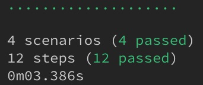

End-to-end (E2E) tests allow developers to test the flow of their applications. Let's say you have a very basic calculator app that allows a user to enter two numbers and get a result. So a test you might want to run is that entering "1" in the first input and entering "2" in the second results in "3" when the user is performing an addition operation.

In this post, we're going to walk through setting up Protractor and Cucumber within an Angular application to enable smooth E2E testing. We'll walk through a few different test scenarios to get us familiar with the core concepts, and explore a few resources along the way that will allow us to dive in deeper later.

For this walkthrough, let's spin up a new Angular project with the [Angular CLI](https://angular.io/cli):

```bash
ng new angular-with-cucumber
```

If you have an existing project you've spun up with the Angular CLI, feel free to work with that. You'll want to make sure your project is spun up with the Angular CLI because includes Protractor (and the Protractor setup) by default.

## Getting familiar with Protractor

As the bread and butter of E2E testing in Angular, it's important to have a firm grasp on the Protractor basics. The Protractor site has a great [tutorial](https://www.protractortest.org/#/tutorial) we can use as a starting point.

Go ahead an open up your Angular project, and navigate to the `e2e` folder. In there, you should see a folder and two files--something like this:

```
.
├── e2e
├── src
    ├── app.e2e-spec.ts
    └── app.po.ts
├── protractor.conf.js
└── tsconfig.json
```

Open `e2e/src/app.e2e-spec.ts` and delete the contents of the file. We're going to write our tutorial tests here.

The first step of the Protractor tutorial is to [write a test](https://www.protractortest.org/#/tutorial#step-0-write-a-test). Go ahead and add the code from their `spec.js` file to your `e2e/src/app.e2e-spec.ts` file.

```ts
// app.e2e-spec.ts
import { browser } from "protractor";

describe("Protractor demo app", () => {
  it("should have a title", () => {
    browser.get("http://juliemr.github.io/protractor-demo/");

    expect(browser.getTitle()).toEqual("Super Calculator");
  });
});
```

Since Protractor is already set up in our project and it comes with a a configuration file (`e2e/protractor.conf.js`), we can simply run our test:

```bash
npm run e2e
```

When you run this command, a few things should happen:

1. Your app compiles
1. A Selenium server is started
1. A browser pops open (and probably closes shortly after)
1. Your terminal indicates your test has successfully completed


You've just successfully run your first E2E test! 🎉

This test isn't very exciting. Let's go ahead and add to our spec by adding the next example in the Protractor tutorial as a new `it` block:

```ts
// app.e2e-spec.ts
import { browser, element, by } from "protractor";

describe("Protractor demo app", () => {
  it("should have a title", () => {
    browser.get("http://juliemr.github.io/protractor-demo/");

    expect(browser.getTitle()).toEqual("Super Calculator");
  });

  it("should add one and two", () => {
    browser.get("http://juliemr.github.io/protractor-demo/");

    element(by.model("first")).sendKeys(1);
    element(by.model("second")).sendKeys(2);

    element(by.id("gobutton")).click();

    expect(element(by.binding("latest")).getText()).toEqual("5");
  });
});
```

This new test demonstrates how we can interact with our application to test whether the app behaves as we expect.

`element` and `by` are methods of Protractor that allow us to find HTML Elements on the DOM. `sendKeys()` allows us to interact with those elements by entering data, and `click()` allows us to simulate a click. These concepts are key to successful E2E testing with Protractor, and I highly recommend reviewing [Using Locators](https://www.protractortest.org/#/locators) in the Protractor documentation.

If you run your test now (`npm run e2e`), you should see one success and one failure. Go ahead and fix the test and run it again.

Let's continue with the next step of the tutorial, where we'll add more scenarios and refactor our test a bit so we're not including so much redundant code.

```ts
// app.e2e-spec.ts
import { browser, element, by } from "protractor";

describe("Protractor demo app", () => {
  const firstNumber = element(by.model("first"));
  const secondNumber = element(by.model("second"));
  const goButton = element(by.id("gobutton"));
  const latestResult = element(by.binding("latest"));

  beforeEach(() => {
    browser.get("http://juliemr.github.io/protractor-demo/");
  });

  it("should have a title", () => {
    expect(browser.getTitle()).toEqual("Super Calculator");
  });

  it("should add one and two", () => {
    firstNumber.sendKeys(1);
    secondNumber.sendKeys(2);

    goButton.click();

    expect(latestResult.getText()).toEqual("3");
  });

  it("should add four and six", () => {
    firstNumber.sendKeys(4);
    secondNumber.sendKeys(6);

    goButton.click();

    expect(latestResult.getText()).toEqual("10");
  });

  it("should read the value from an input", () => {
    firstNumber.sendKeys(1);
    expect(firstNumber.getAttribute("value")).toEqual("1");
  });
});
```

You'll notice that we are including a `beforeEach()` method which executes before _every_ `it` block in our test. In this case, it's navigating to the site where the demo app lives. We've also saved our elements to variables which will allow us to reuse them across test cases.

So far, we've covered the basics of Protractor testing. There are more examples you can (and probably should) work through on the tutorial page, but for now, let's move on to the next step&ndash;Page Objects.

## Improving test organization with Page Objects

At the end of the last section, we started cleaning up our test by creating variables that allowed us to reuse elements across `it` blocks. We can take this a step further by implementing [Page Objects](https://www.protractortest.org/#/page-objects) which encapsulates information for our tests in a separate JavaScript class.

Open `e2e/src/app.po.ts` and delete the contents of the file. We'll use the file to create the page object for our tests.

This first thing we're going to do is add our elements to the file:

```ts
// app.po.ts
import { ElementFinder, element, by } from "protractor";

export class CalculatorPage {
  firstNumber: ElementFinder;
  secondNumber: ElementFinder;
  goButton: ElementFinder;
  latestResult: ElementFinder;

  constructor() {
    this.firstNumber = element(by.model("first"));
    this.secondNumber = element(by.model("second"));
    this.goButton = element(by.id("gobutton"));
    this.latestResult = element(by.binding("latest"));
  }
}
```

Because later versions of Angular use Typescript, we'll first declare and type variables (as `ElementFinder` which comes from `@types/protractor`), then we'll initialize the variables within the class' constructor.

We can now update our spec file, replacing the variables within the spec with the variables in our page object:

```ts
// app.e2e-spec.ts
import { browser } from "protractor";
import { CalculatorPage } from "./app.po";

const calc = new CalculatorPage();

describe("Protractor demo app", () => {
  beforeEach(() => {
    browser.get("http://juliemr.github.io/protractor-demo/");
  });

  it("should have a title", () => {
    expect(browser.getTitle()).toEqual("Super Calculator");
  });

  it("should add one and two", () => {
    calc.firstNumber.sendKeys(1);
    calc.secondNumber.sendKeys(2);

    calc.goButton.click();

    expect(calc.latestResult.getText()).toEqual("3");
  });

  it("should add four and six", () => {
    calc.firstNumber.sendKeys(4);
    calc.secondNumber.sendKeys(6);

    calc.goButton.click();

    expect(calc.latestResult.getText()).toEqual("10");
  });

  it("should read the value from an input", () => {
    calc.firstNumber.sendKeys(1);
    expect(calc.firstNumber.getAttribute("value")).toEqual("1");
  });
});
```

There are a couple of neat things about storing our variables in a page object:

1. We can reuse these variables across tests
1. If the applications changes, we can update the page object, rather than individual tests

Let's go ahead and add some methods to our page object.

```ts
// app.po.ts
import { ElementFinder, element, by, browser } from "protractor";

export class CalculatorPage {
  firstNumber: ElementFinder;
  secondNumber: ElementFinder;
  goButton: ElementFinder;
  latestResult: ElementFinder;

  constructor() {
    this.firstNumber = element(by.model("first"));
    this.secondNumber = element(by.model("second"));
    this.goButton = element(by.id("gobutton"));
    this.latestResult = element(by.binding("latest"));
  }

  async navigateTo() {
    await browser.get("http://juliemr.github.io/protractor-demo/");
  }

  async setValues(first: number, second: number) {
    await this.firstNumber.sendKeys(first);
    await this.secondNumber.sendKeys(second);
  }
}
```

You'll notice that in addition to adding the `navigateTo()` and `setValues()` methods, we've introduced [`async` / `await`](https://developer.mozilla.org/en-US/docs/Web/JavaScript/Reference/Statements/async_function). Currently, Protractor implements the [WebDriver Control Flow](https://github.com/angular/protractor/blob/master/docs/control-flow.md) which helps tests execute in a synchronous manner. However, WebDriver Control Flow is being removed, and Protractor suggests using [`async` / `await` to manage the control flow](https://www.protractortest.org/#/async-await) instead.

When we use the `async` / `await` methods in our spec, we'll need to make sure we implement the `it` blocks asynchronously too:

```ts
// app.e2e-spec.ts
import { browser } from "protractor";
import { CalculatorPage } from "./app.po";

const calc = new CalculatorPage();

describe("Protractor demo app", () => {
  beforeEach(async () => {
    await calc.navigateTo();
  });

  it("should have a title", () => {
    expect(browser.getTitle()).toEqual("Super Calculator");
  });

  it("should add one and two", async () => {
    await calc.setValues(1, 2);
    await calc.goButton.click();

    expect(calc.latestResult.getText()).toEqual("3");
  });

  it("should add four and six", async () => {
    await calc.setValues(4, 6);
    await calc.goButton.click();

    expect(calc.latestResult.getText()).toEqual("10");
  });

  it("should read the value from an input", () => {
    calc.firstNumber.sendKeys(1);
    expect(calc.firstNumber.getAttribute("value")).toEqual("1");
  });
});
```

Once you've updated your test to use the page object, go ahead and run the tests (`npm run e2e`) to make sure everything is working as expected.

Now that we have the basics of Protractor covered, let's add Cucumber.

## Add Cucumber for improved collaboration

[Cucumber](https://cucumber.io/) is a tool for behavior-driven development (BDD) that allows developers to write test cases in plain text, making them easier to understand and debug. Since scenarios are written in plain text, anyone from your developer colleagues, your product manager, or your dear grandma Doris can understand what is under test. This is key because it helps the entire team be more accountable for software quality.

First, we'll need to install a few dependencies. Go ahead and run the following within your project:

```bash
npm install --save-dev @types/{chai,chai-as-promised,cucumber} chai chai-as-promised cucumber cucumber-html-reporter protractor-cucumber-framework
```

Next, let's create a Cucumber feature file. The [Cucumber Guide](https://cucumber.io/docs/guides/10-minute-tutorial/) has a pretty good tutorial for writing Cucumber tests. But for continuity we'll continue with our calculator test.

Under `e2e`, add a new `features` directory, and add a file called `calculator.feature`. Open the file and add a test case:

```gherkin
# features/calculator.feature
Feature: Calculator

  A super calculator that performs operations on two numbers.

  Scenario: Add two numbers
    Given I have navigated to the calculator
    When I add two numbers "1" and "2"
    Then the displayed output should be "3"
```

You'll notice that the syntax (called [Gherkin](https://cucumber.io/docs/gherkin/)) is much different than the Jasmine syntax we used for our Protractor tests. Let's break this down a bit:

- **`Feature`**: the name of the feature you're testing which should generally be close in name to your file
- **`Scenario`**: an example of how your application should behave
- **`Given`**, **`When`**, **`Then`**: the steps (behaviors) one takes to execute the scenario

Now that we have a Cucumber test case, we'll need to make some updates to `e2e/protractor.conf.ts` to tell Protractor that we'll be using the Cucumber framework:

```js
// protractor.conf.js
/**
 * @type { import("protractor").Config }
 */
exports.config = {
  allScriptsTimeout: 11000,
  specs: ["./features/*.feature"],
  capabilities: {
    browserName: "chrome",
  },
  directConnect: true,
  baseUrl: "http://localhost:4200/",
  framework: "custom",
  frameworkPath: require.resolve("protractor-cucumber-framekwork"),
};
```

Go ahead and run `npm run e2e` again, and have a peak in the terminal once it's finished. You should see something like this:


This console output is a stubbed out step definition file, which we'll review in the next section.

## Step definitions

While the `calculator.feature` file helped us outline a test to run in plain text, we still need to implement code to execute the test. The code we'll implement is a set of _steps_ required to carry out the scenario. In Cucumber terminology, this is called a **step definition**. The output we saw in the terminal in the previous section is a set of steps we're going to take in our step definition file. Let's go ahead and start implementing these steps.

Under `e2e`, add a new `steps` directory, and add a file called `calculator.step.ts`. Open the file, and copy the stubbed tests from your terminal into the file:

```ts
// calculator.steps.ts
import { Given, When, Then } from "cucumber";

Given("I have navigated to the calculator", () => {
  // Write code here that turns the phrase above into concrete actions
  return "pending";
});

When("I add two numbers {string} and {string}", (string, string2) => {
  // Write code here that turns the phrase above into concrete actions
  return "pending";
});

Then("the displayed output should be {string}", (string) => {
  // Write code here that turns the phrase above into concrete actions
  return "pending";
});
```

Next, we'll replace the code between each of the `Given`, `When`, `Then` blocks with our actual test code. The good news is that we've already done a lot of the heavy lifting for this when we created our page object.

Let's focus on the `Given` block first. For this step, we just need to navigate to the calculator page. Let's go ahead and use our page object method to do this:

```ts
// calculator.steps.ts
import { CalculatorPage } from "../src/app.po";
const calc = new CalculatorPage();

Given("I have navigated to the calculator", async () => {
  await calc.navigateTo();
});
```

Before proceeding, we need to add a global `timeout.ts` file within our `steps` directory. Because the tests run asynchronously, we sometimes end up in situations where a step hasn't had time to execute before moving onto the next. In many cases, such as our `Given` block above, that step is vital in navigating us to the page under test. By adding a timeout file, we can give the browser more time to work its magic before Protractor fails.

```ts
// timeout.ts
import { setDefaultTimeout } from "cucumber";

setDefaultTimeout(60 * 1000);
```

Additionally, we need to make two updates to our `protractor.conf.js` file:

```js
// protractor.conf.js
/**
 * @type { import("protractor").Config }
 */
exports.config = {
  allScriptsTimeout: 11000,
  specs: ["./features/*.feature"],
  capabilities: {
    browserName: "chrome",
  },
  directConnect: true,
  baseUrl: "http://localhost:4200/",
  framework: "custom",
  frameworkPath: require.resolve("protractor-cucumber-framework"),
  cucumberOpts: {
    require: ["./steps/*.steps.ts"],
  },
  onPrepare() {
    require("ts-node").register({
      project: require("path").join(__dirname, "./tsconfig.json"),
    });
  },
};
```

`cucumberOpts.require` tells Cucumber where our step definition files live within our project. It accepts a globbing pattern saving us the time of typing in the name of each step definition file separately.

We also need an `onPrepare()` function to transpiles the Typescript files before executing the tests. Now we're ready to run `npm run e2e` again. This time, you should see something like this:


The checkmark to the left of the `Given` line in the terminal indicates that this step of the test is passing. Hooray! 🎉

At this point, we can work on implementing the other steps:

```ts
// calculator.steps.ts
import { Given, When, Then } from "cucumber";
import { CalculatorPage } from "../src/app.po";

const calc = new CalculatorPage();

Given("I have navigated to the calculator", async () => {
  await calc.navigateTo();
});

When("I add two numbers {string} and {string}", async (string, string2) => {
  await calc.setValues(string, string2);
  await calc.goButton.click();
});

Then("the displayed output should be {string}", (string) => {
  calc.latestResult.getText().then((text) => console.log(text));
});
```

You'll notice that I haven't fully implemented the `Then` block, and that's because this is typically where we'll actually check that our test does what we _expect_. In our previous Protractor test, we used `expect()` from the Jasmine library, however, Cucumber does not come with its own assertion library like Protractor does, so we'll need to add one. When we installed additional dependencies earlier, we included `chai`, and we'll be using [Chai's `expect` assertions](https://www.chaijs.com/guide/styles/#expect) for testing.

Another thing to note about our `Then` block is that it's resolving a promise. If we try to log `calc.latestResult.getText()` directly, we'll see that we're getting the `ElementFinder` object rather than the text itself. The promise gives us an opportunity to grab the text itself.

In the next section, we'll add Chai and Chai as Promised in addition to a few more scenarios for testing.

## Working with Chai and Chai as Promised

Since Cucumber does not ship with its own assertion library, we'll need to pull one in. We already installed Chai and Chai as Promised when we installed additional dependencies earlier, so now it's time to implement them.

Let's add Chai to our `calculator.steps.ts` file and write our first assertion:

```ts
// calculator.steps.ts
import { Given, When, Then } from "cucumber";
import { CalculatorPage } from "../src/app.po";
import * as chai from "chai";

const calc = new CalculatorPage();
const expect = chai.expect;

Given("I have navigated to the calculator", async () => {
  await calc.navigateTo();
});

When("I add two numbers {string} and {string}", async (string, string2) => {
  await calc.setValues(string, string2);
  await calc.goButton.click();
});

Then("the displayed output should be {string}", (string) => {
  calc.latestResult.getText().then((text) => expect(text).to.equal(string));
});
```

We're pulling in all Chai functions when we use `import * as chai from 'chai'`. Then, we create a new `expect` variable assigning `chai.expect` to it so we can use it like we used `expect()` previously.

In the `Then` block, you'll notice a small difference in the chains for checking an assertion, but that's really the only difference between Jasmine and Chai. Check out the [API reference for Chai's BDD chains](https://www.chaijs.com/api/bdd/) for the different expectation that can be chained.

We can clean up our assertion and remove the promise chain by pulling in Chai as Promised:

```ts
// calculator.steps.ts
import { Given, When, Then, Before } from "cucumber";
import { CalculatorPage } from "../src/app.po";
import * as chai from "chai";
import * as chaiAsPromised from "chai-as-promised";

const calc = new CalculatorPage();
const expect = chai.expect;

Before(() => {
  chai.use(chaiAsPromised);
});

Given("I have navigated to the calculator", async () => {
  await calc.navigateTo();
});

When("I add two numbers {string} and {string}", async (string, string2) => {
  await calc.setValues(string, string2);
  await calc.goButton.click();
});

Then("the displayed output should be {string}", (string) => {
  expect(calc.latestResult.getText()).to.eventually.equal(string);
});
```

By including `chai.use(chaiAsPromised)` in the `Before()`, which is called before each step (similar to `beforeEach()` earlier), we make Chai As Promised, and its `eventually` chain available for monitoring asynchronous calls. Whether you prefer this over the promise syntax is entirely up to you.

Now that we have our testing basics down, let's go back to our `calculator.feature` file and add some more tests. In our initial `app.e2e-spec.ts`, we had two tests for our addition functionality. Let's add the second test to our Cucumber file:

```gherkin
# calculator.feature
Feature: Calculator

  A super calculator that performs operations on two numbers.

  Scenario: Add two numbers
    Given I have navigated to the calculator
    When I add two numbers "1" and "2"
    Then the displayed output should be "3"

  Scenario: Add two numbers
    Given I have navigated to the calculator
    When I add two numbers "4" and "6"
    Then the displayed output should be "10"
```

Go ahead and run `npm run e2e` in your terminal. In theory, this _should_ just work, but you may encounter a funky error along the lines of:

```
E/launcher - javascript error: angular is not defined
```

Let's make a small tweak to the step definition file to add a `sleep`, which will have the browser wait three seconds before proceeding.

```ts
// calculator.step.ts
import { Given, When, Then, Before } from "cucumber";
import { CalculatorPage } from "../src/app.po";
import * as chai from "chai";
import * as chaiAsPromised from "chai-as-promised";
import { browser } from "protractor";

const calc = new CalculatorPage();
const expect = chai.expect;

Before(() => {
  chai.use(chaiAsPromised);
});

Given("I have navigated to the calculator", async () => {
  await calc.navigateTo();
});

When("I add two numbers {string} and {string}", async (string, string2) => {
  await calc.setValues(string, string2);
  await calc.goButton.click();
});

Then("the displayed output should be {string}", (string) => {
  browser.sleep(3000);
  expect(calc.latestResult.getText()).to.eventually.equal(string);
});
```

Try running `npm run e2e` again to see the test pass.

It's pretty neat that we have two passing scenarios now, but we didn't make any updates to our step definition file, so how is this possible? There are two elements at play here:

1. We double-quoted the numbers in our scenarios (e.g. `"1"`, `"2"`, etc.), which parameterizes the values in Cucumber
1. We kept the language between both scenarios the same, only updating the parameterized values

When we ran `npm run e2e` after adding the first scenario, some of the stubbed out steps contained parameters:

```ts
When("I add two numbers {string} and {string}", (string, string2) => {
  // Write code here that turns the phrase above into concrete actions
  return "pending";
});
```

By adding another scenario with the same language, but different parameters, we are able to test another scenario without rewriting our step definition. Neat, right? Believe it or not, we can actually simplify this even further, which we'll cover in the final section.

## Pairing Cucumber variables with Examples

Now that we know we can parameterize our Cucumber tests, we can work toward simplifying our tests further which will allow us to easily run several tests for a given scenario.

First, let's update our `calculator.feature` file to use the `Scenario Outline` and replace our parameters with variables:

```gherkin
# calculator.feature
Feature: Calculator

  A super calculator that performs operations on two numbers.

  Scenario Outline: Add two numbers
    Given I have navigated to the calculator
    When I add two numbers "<first>" and "<second>"
    Then the displayed output should be "<result>"
```

Next, we need to add an `Examples` table to tell Cucumber what values we want to pass into our scenario:

```gherkin
# calculator.feature
Scenario Outline: Add two numbers
    Given I have navigated to the calculator
    When I add two numbers "<first>" and "<second>"
    Then the displayed output should be "<result>"

Examples:
  | first | second | result |
  | 1     | 2      | 3      |
  | 4     | 6      | 10     |
```

Notice that the first row of our table defines the variables we used in our scenario. Within the column for each variable, we define the values we want to pass. For example, in the second row of the table, we have `first = 1`, `second = 2`, and `result = 3`. We can easily expand our scenarios simply by adding more examples, rather than writing more scenarios:

```gherkin
# calculator.feature
Feature: Calculator

  A super calculator that performs operations on two numbers.

  Scenario Outline: Add two numbers
    Given I have navigated to the calculator
    When I add two numbers "<first>" and "<second>"
    Then the displayed output should be "<result>"

    Examples:
      | first | second | result |
      | 1     | 2      | 3      |
      | 4     | 6      | 10     |
      | 13    | 13     | 26     |
      | 234   | 4564   | 4798   |
```

When I run `npm run e2e`, I now have four passing scenarios and 12 passing tests.



This wraps up our introduction to E2E testing with Protractor and Cucumber. We've covered a lot of ground, but there's even more we can do with the Protractor & Cucumber integration including automating HTML reports and grabbing screenshots when tests fail. Be on the lookout for a second part coming soon!

If you'd like to see the completed setup, you can find [angular-with-protractor-and-cucumber on Github](https://github.com/carrieforde/angular-with-protractor-and-cucumber).

## Resources

- [Protractor](https://www.protractortest.org/)
- [Cucumber documentation](https://cucumber.io/docs/cucumber/)
- [Gherkin syntax documentation](https://cucumber.io/docs/gherkin/)
- [Chai](https://www.chaijs.com/)
- [Chai as Promised](https://www.chaijs.com/plugins/chai-as-promised/)
- [Protractor Cucumber Framework](https://github.com/protractor-cucumber-framework/protractor-cucumber-framework)
- [Cucumber JS](https://github.com/cucumber/cucumber-js)

## Addendum: when tests don't go as expected

I came across some issues with the asynchronous nature of Protractor as I was implementing Cucumber on a work project. Let's be real, I came across _a lot_ of challenges while implementing this at work.

One issue I bumped up against repeatedly was this error:

```
E/launcher - Error while waiting for Protractor to sync with the page: "both angularJS testability and angular testability are undefined.  This could be either because this is a non-angular page or because your test involves client-side navigation, which can interfere with Protractor's bootstrapping.
```

After a lot of searching, painful tutorials, and some trial and error, I finally figured out this error occurs because Protractor doesn't have enough time with the browser open to actually hit the site under test. If you're encountering a similar issue, you might want to try something like this:

```ts
Given("I have navigated to the calculator", async () => {
  await browser.wait(calc.navigateTo(), 5000);
});
```

`browser.wait()` takes a condition or promise to resolve and an optional timeout (a message can also be passed). The timeout will wait for `timeout` time for the condition to be true (i.e. resolved) before proceeding.

These _quirks_ have been the most challenging part of familiarizing myself with Protractor and using Cucumber. The main takeaway here is that you may need to tweak things in the usage of Protractor (by trying things from the [API](https://www.protractortest.org/#/api)) until you get a concrete pass **or** fail. If you're getting errors, keep tweaking until you get that pass or fail.
