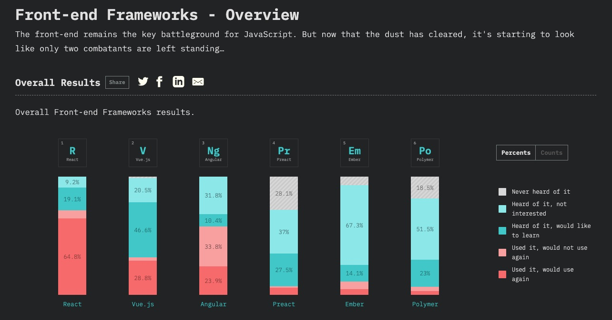
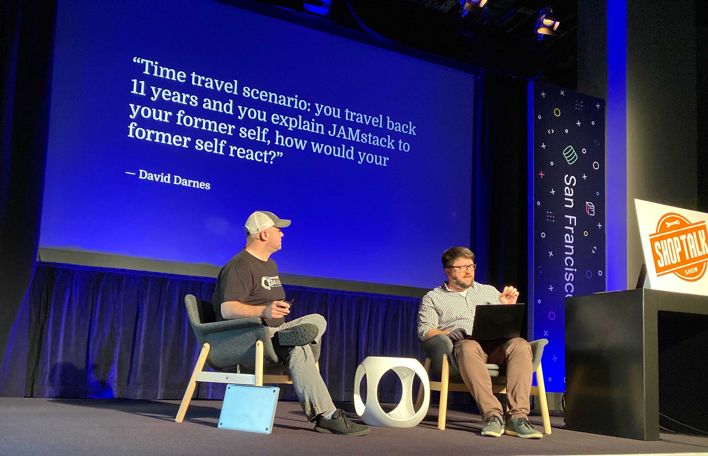

There's a lot of buzz in the front end community around JAMstack&mdash;JavaScript, APIs, and markup. It's a term that broadly reflects the modern front end developer's stack. With front end focus often being on frameworks (React, Vue, Angular, etc.), one could argue there's typically more emphasis on the **J** in JAMstack than the A or M.

The JAMstack Conference was an opportunity for folks to learn more about the benefits of JAMstack, tooling in the space, and meet others excited about the technologies used in the space.

Key themes for the conference included performance, JAMstack at scale, and the tools that generally go hand-in-hand with JAMstack. Performance was a point of particular interest to me because it has so many implications for the user experience, SEO, etc, and it's been an area of focus for me since I started at FFN. My explorations in improving web performance are what ultimately lead me to JAMstack in the first place.

## The JAMstack toolkit

One of the things I love about JAMstack is the variety of tooling available to front end developers, and there are lots of tools to choose from. These tools are often used in combination, and tend to fall in these categories:

- Frameworks
- Frameworks for Frameworks (meta-frameworks)
- Static Site Generators (SSG)
- Headless CMSes
- Static site hosts

JavaScript frameworks are the heart JAMstack, and most modern front end devs are familiar with the framework landscape, likely using a framework regularly. According to last year's [State of JavaScript survey](https://2018.stateofjs.com/front-end-frameworks/overview/), React currently leads popularity, and based on the talks I heard over the two days, it seems React is leading in the JAMstack space, too.

Meta-frameworks including [Next.js](https://nextjs.org/) or [Nuxt.js](https://nuxtjs.org/), are another big player in JAMstack. These frameworks do a lot of heavy lifting for developers allowing us to easily set up server-side rendering, static site generation, code splitting, hot module replacement, etc. While I'd heard of both Next.js and Nuxt.js before the conference, I'd never bothered looking at either. But now that I have a better sense of what these meta-frameworks offer, I'm certainly interested in digging in, learning more, and seeing how I could use one in my day-to-day.

Static site generators like [Gatsby](https://www.gatsbyjs.org/), [VuePress](https://vuepress.vuejs.org/), or [Hugo](https://gohugo.io/), are also big in the space. SSGs rely on the build step during CI/CD to build a site into static files and deploy them to a host. SSGs often come with huge performance benefits because the build step aggressively shakes out unused styles and scripts, and only serves assets absolutely required on page load. Additionally, SSG sites typically have fewer attack vectors because less client-side JavaScript is required.

To make content editing & management easier, JAMstack sites are often paired with a headless CMS. It's worth noting that going headless isn't an absolute requirement. WordPress, for example, can be paired with Gatsby for static site generation (although, I do think there are challenges with this approach). The landscape of headless CMSes is broad, and includes [Contentful](https://www.contentful.com/), [Sanity](https://www.contentful.com/), [Forestry](https://forestry.io/), [Netlify CMS](https://www.netlifycms.org/) among many others. And while these headless solutions not only make the editing experience better for content managers, they also allow developers to easily customize the underlying API.

One of the most compelling tools I've seen for site editing is [TinaCMS](https://tinacms.org/), which claims to not actually be a CMS, but rather an in-situ site editing experience. Of the challenges I've seen folks face when working with WordPress, not understanding _how_ components work in context has been the biggest. TinaCMS aims to solve this problem, and I can't wait to try it.

If you're looking for a bit of a broader overview of the JAMstack toolkit, Chris Coyier put together a great post of [JAMstack tools](https://css-tricks.com/jamstack-tools-and-the-spectrum-of-classification/) on CSS Tricks.

## Top talks from the conference

Even if you weren't able to make it to the JAMstack conference, you can still watch all the talks on the [JAMstack Conf YouTube channel](https://www.youtube.com/channel/UC8bRyfU7ycLXnEBfvdorpUg). And while I really enjoyed most of the talks, these were among my favorites:

1. **[The Git powered CMS with no server](https://youtu.be/Y2ak5o0IqLw) &ndash; Shawn Erquhart**  
   As a Gatsby + markdown user for this site, this talk felt particularly relatable. But coming from a world of WordPress development, I often think about how one bridges the gap between a Git-based CMS and a fully featured CMS like WordPress. Erquhart does a great job providing ideas for shrinking the gap.
1. **[Static generated sites === great performance. What are you waiting for?](https://youtu.be/H793eyVM_04) &ndash; Deb O'Brien**  
   This is another talk that, as a Gatsby user, strikes home. In her talk, O'Brien lays out many of the benefits of using static site generators, and in particular, the benefits of Nuxt.js. What really piques my interest here is the idea of combining SPAs, SSR, and SSG into one.
1. **[What got us here, won't get us there](https://youtu.be/6VGu4PvEBag) &ndash; Justin Watts**  
   Watts talked about the challenges Loblaws, a large Canadian retailer, had scaling teams and technology, and what teams tried to overcome those challenges. Seems like the takeaway here is that there's _always_ a challenge to overcome, and you have to be willing to iterate to see improvements.
1. **[Migrating JAMstack and OhShitGit](https://youtu.be/PqlhYVqLDm0) &ndash; Katie Sylor-Miller**  
   I came across [OhShitGit](https://ohshitgit.com/) a few years ago, and I have found it to be an incredibly valuable resource in *git*ting out of some sticky situations. Sylor-Miller's talk was a deep-dive into Git, and a the role it plays in the JAMstack.
1. **[Supercharging JAMstack apps with multiple APIs via GraphQL](https://youtu.be/O3j1ho9FBkk) &ndash; Sean Grove**  
   Having been immersed in a more JAMstack-focused role for the past several months, I can see the power of being able to query and work with multiple APIs via GraphQL. Grove walked through an example where he used multiple services to quickly spin up new Netlify sites from SSG setup, to domain purchase, to deployment.

## Takeaways & where to go from here

While the JAMstack can seem a bit overwhelming, I would absolutely invest time learning a few of the tools and frameworks in the ecosystem. For those new to JAMstack or front end development, I'd suggest the following:

1. **Get a solid grasp on vanilla JavaScript**  
   Learning a JS framework is a lot easier if you have a solid grasp of vanilla JavaScript. In particular, you need to understand newer JS concepts like classes, functional JS, Promises, `async` / `await` etc. Also make sure you know how to make API requests&mdash;learn `fetch()` and don't always depend on third-party libraries for making requests.
1. **Choose & learn a JS framework**  
   This narrows down a few choices later, and generally sets you up for success in the front end developer job market. I recommend React, but look at local job postings to see what's relevant your local job market. I'd advise against Angular (even though that's what I use in my day job!) because there is little to no support for SSG, etc.
1. **Choose & learn a SSG and / or meta-framework**  
   SSG & meta-frameworks often work with a specific JS framework. If you've chosen React, you'll learn Gatsby and / or Next.js, for example. Will you be building blogs and content-heavy sites? Learn Gatsby. Will you be building single-page applications or require server-side rendering? Consider Next.js.
1. **Learn CI/CD**  
   JAMstack largely depends on continuous integration / continuous delivery. Learning more about the CI/CD process and tools will benefit you greatly when it comes to deploying your JAMstack projects.
1. **Dig deeper into APIs**  
   At this point, you've done a fair amount of API consumption, now it's time to dig deeper. After working with Gatsby, I'm deeply interested in learning more about [GraphQL](https://graphql.org/) to improve my API queries. If you're interested in spinning up your own APIs, you might consider learning how to build an API with Node using a framework like [Express](https://expressjs.com/).

After the conference, I'm really excited to try TinaCMS, dig deeper into Gatsby, and try Next.js.

In my free time, I've been working on a Gatsby starter largely inspired by [Alcatraz](https://github.com/carrieforde/alcatraz), my WordPress starter theme.

We use Angular at work and I've recently done some deep dives into integrating Firebase. I'd love to create a similar proof of concept with React + Next to see if we can up-level our application and make it more performant.

There are so many exciting possibilities in the front end ecosystem right now, and I can't wait to explore!
