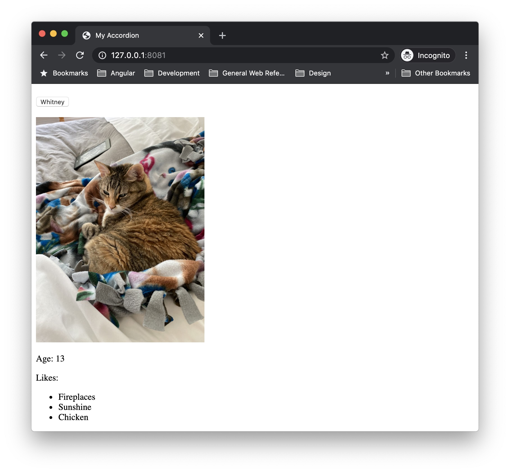

<CallOut type="info">
  You can find the{" "}
  <a href="https://github.com/alcatraz-components/accordion">
    source code for the accordion web component
  </a>{" "}
  on Github.
</CallOut>

Last spring, I worked on a project where we supplied static content from a WordPress site to a React app via the REST API. The challenge we faced in this project was that the content from the WordPress site included interactive components.

Creating a content block for interactive components in a standard WordPress install is no problem. We can detect when the block is used, and enqueue the JavaScript (JS) required for the blocks's interactivity. But when that same block is saved to the WP REST API, only its markup is available, and replicating the block's interactivity in a JS application becomes more challenging.

[Web components](https://developer.mozilla.org/en-US/docs/Web/Web_Components) offer an enticing solution to this problem. Web components allow developers to create custom elements (i.e. HTML elements), that encapsulate their own styles and JS. Now, if we ship the markup for the custom element over an API, and also include the web component scripts in our application, we've solved the problem sharing interactive components.

In this post, I'll walk through building an interactive accordion web component that can be used in any type of web application.

## Pre-requisites for building web components

Building a web component requires a decent amount of JS knowledge. DOM expertise is a must, comfort with [ES2015 classes](https://developer.mozilla.org/en-US/docs/Web/JavaScript/Reference/Classes) is important, and you will need to know a few Array methods including [`map()`](https://developer.mozilla.org/en-US/docs/Web/JavaScript/Reference/Global_Objects/Array/map) and [`Array.from()`](https://developer.mozilla.org/en-US/docs/Web/JavaScript/Reference/Global_Objects/Array/from).

You won't need extensive command line experience for this tutorial, but you will need to run a few commands. With all this said, let's define what we're building.

To demonstrate how web components can handle interactivity, we're going to build an accordion component. Here are the requirements for our accordion:

- allow a user to expand & collapse panels
- have an option to determine whether one panel is open at a time, or if several can be open
- use accessible markup
- support keyboard users

## Spinning up the accordion project

We'll start the accordion component by creating a new directory and initializing a new `npm` project.

```bash
mkdir my-accordion
cd my-accordion
npm init
```

Follow the prompts on the screen to initialize your `npm` project.


Next, install Lit Element.

```bash
npm install lit-element
```

As the site states, [Lit Element](https://lit-element.polymer-project.org/) is &ldquo;a simple base class for creating fast, lightweight web components,&rdquo; that makes spinning up new web components super easy. It offers utilities for easily styling web components, creating component templates, and lifecycle hooks for updating your web component.

Before proceeding to the next step, review the [Lit Element starting guide](https://lit-element.polymer-project.org/guide/start) to setup your environment to use Lit Element locally. Most importantly, you should make sure you have the [`polymer-cli`](https://www.npmjs.com/package/polymer-cli) installed.

Now that we have Lit Element set up, let's add some new files to our project. We only need a JS and HTML file to start. Including a `.gitignore` file is a good idea if you plan to push your project to a remote Git server. The project structure should look something like this:

```
.
├── node_modules
├── .gitignore
├── index.html
├── index.js
├── package-lock.json
└── package.json
```

Now that our project is spun up, we're ready to start coding.

### Scaffolding a basic component

Let's start by simply outputting &ldquo;Hello World&rdquo;. Add the following code to `index.js`:

```js
// index.js
import { LitElement, html } from "lit-element";

class MyAccordion extends LitElement {
  render() {
    return html` Hello World 🌍 `;
  }
}

customElements.define("my-accordion", MyAccordion);
```

The `render()` method returns our component's HTML template. The `html` function is simply a wrapper for creating the template. `customElements.define()` allows us to define a name for our web component, and associate the extended `LitElement` class to this tag.

<CallOut type="warning">
  All custom elements (i.e. web components) must use hyphenated names to avoid
  conflicting with existing HTML elements.
</CallOut>

Now that the web component is defined, we're ready to use it in our HTML. Let's add a basic HTML5 scaffold to `index.html` adding our web component script, and placing an instance of our custom element in the `body`:

```html
<!-- index.html -->
<!DOCTYPE html>
<html lang="en">
  <head>
    <title>My Accordion</title>
    <script type="module" src="index.js"></script>
  </head>
  <body>
    <my-accordion></my-accordion>
  </body>
</html>
```

The `script` tag imports the `index.js` file where we defined our new web component. We added `type="module"` because we're using [JS modules](https://developer.mozilla.org/en-US/docs/Web/JS/Guide/Modules) in this project (e.g. `import { LitElement, html } from LitElement;`).

`<my-accordion></my-accordion>` is what actually outputs our new web component to the screen. If you kick off `polymer serve` in your terminal, and visit the link, you should see our new web component. 🎉


We've taken our first step to creating a web component, by creating a component that outputs static text, but now it's time to get into building our accordion.

## Adding the accordion template

First, we'll update the `render()` method and replace `Hello World 🌍` with a `slot`.

```js
// index.js
import { LitElement, html } from "lit-element";

class MyAccordion extends LitElement {
  render() {
    return html` <slot></slot> `;
  }
}

customElements.define("my-accordion", MyAccordion);
```

A `slot` is like a placeholder for other content in a component. In this case, we've left our `slot` unnamed, but you can name slots to have specific areas for your component's content. At this point, this is all we need the accordion file to do. We'll use this component as a wrapper for our &ldquo;panels&rdquo;, and actually output our content in a separate web component.

Let's go ahead and create a new JS file called `panel.js`. Following the [WAI-ARIA Authoring Practices](https://www.w3.org/TR/wai-aria-practices-1.1/) for accordions, we'll do our best to ensure our panel template uses semantic markup and ARIA attributes appropriately.

```js
import { LitElement, html } from "lit-element";

class MyAccordionPanel extends LitElement {
  render() {
    return html`
      <h3>
        <button
          id="button1"
          type="button"
          aria-expanded="true"
          aria-controls="panel1"
        >
          Whitney
        </button>
      </h3>
      <div id="panel1" role="region" aria-labelledby="panel1">
        
        <p>Age: 13</p>
        <p>Likes:</p>
        <ul>
          <li>Fireplaces</li>
          <li>Sunshine</li>
          <li>Chicken</li>
        </ul>
      </div>
    `;
  }
}

customElements.define("my-accordion-panel", MyAccordionPanel);
```

We can quickly test the panel behaves as expected. First, add the following line to `index.js`:

```js
import "./panel";
```

Then add an instance of the panel inside your `my-accordion` element in `index.html`:

```html
<!-- index.html -->
<my-accordion>
  <my-accordion-panel></my-accordion-panel>
</my-accordion>
```

Now if we refresh the browser, we should see our updated web component with the `my-accordion-panel` component.



This is a good start, but we want to allow users to add their own content to `my-accordion-panel`. The easiest change to make the component more flexible is to replace the content within the `div` with a `slot`. Next, we'll introduce properties to handle the button text and panel state.

```js
import { LitElement, html } from "lit-element";

class MyAccordionPanel extends LitElement {
  constructor() {
    super();

    this.label = "";
    this.expanded = false;
  }

  static get properties() {
    return {
      label: { type: String },
      expanded: { type: Boolean },
    };
  }

  expand() {
    return (this.expanded = !this.expanded);
  }

  kebabCase(string) {
    return string.replace(/\s/g, "-").toLowerCase();
  }

  render() {
    return html`
      <h3>
        <button
          id="${this.kebabCase(this.label)}-button"
          type="button"
          .aria-expanded="${this.expanded}"
          aria-controls="${this.kebabCase(this.label)}-panel"
          @click="${() => this.expand()}"
        >
          ${this.label}
        </button>
      </h3>
      <div
        id="${this.kebabCase(this.label)}-panel"
        role="region"
        aria-labelledby="${this.kebabCase(this.label)}-button"
        .hidden="${!this.expanded}"
      >
        <slot></slot>
      </div>
    `;
  }
}

customElements.define("my-accordion-panel", MyAccordionPanel);
```

The first thing we're doing is setting up the class `constructor`. Because the panel class extends LitElement, we need to call `super()`, then we can add and set default values for the properties we want to use: `label` and `expanded`.

Next, we set up the `properties()` getter from LitElement. Properties are useful because LitElement will always be listening for changes to properties, and will update our component appropriately when changes are detected. In this instance, we're doing two things when call the `properties` getter:

1. Declare the properties we're going to use in the component.
1. Convert the property type.

There's a bit of nuance when thinking about converting the property type, so let's look at an example.

Our `button` has an `aria-expanded` attribute, and when we set this attribute, we expect it to be either `aria-expanded="true"` or `aria-expanded="false"`. HTML attributes are always represented as strings regardless of whether they are boolean values (as in this case), or not. By using the `properties()` getter, we can tell LitElement that when we're working with `expanded` in the pure JS, we expect it to be converted to a boolean, but when it's used in the HTML template it's converted to a string.

After setting up the `properties()` getter, we have a method to handle updating the state of `expanded`, and a helper method, `kebabCase`, that will make it easier to create unique IDs for the panels in the HTML.

Finally, the `render()` method has been updated to use the newly defined properties. You may notice that `aria-expanded` and `hidden` both have a `.` prepended to them. The `.` tells LitElement to bind that attribute's property to one of our declared properties so it renders correctly in the HTML.

Now we can update the content of `my-accordion` in `index.html`:

```html
<my-accordion>
  <my-accordion-panel label="K2" expanded="true">
    <p>Age: 13</p>
    <p>Color: gray</p>
  </my-accordion-panel>
  <my-accordion-panel label="Whitney">
    <p>Age: 13</p>
    <p>Color: orange</p>
  </my-accordion-panel>
  <my-accordion-panel label="Minnie">
    <p>Age: 4</p>
    <p>Color: gray</p>
  </my-accordion-panel>
  <my-accordion-panel label="Paul">
    <p>Age: 3</p>
    <p>Color: orange</p>
  </my-accordion-panel>
</my-accordion>
```

Here, you'll see that we're using `label` and `expanded` as attributes. These will be passed down to `my-accordion-panel` as properties.

If you reload the page, you will see a fully-functioning accordion.

## Styling a web component

The basic mechanics of the accordion are fine, but it doesn't look pretty, so in this section we'll focus on adding styles.

We'll start our styles by adding a border around `my-accordion`. To do this, we'll add a `styles()` getter to the `MyAccordion` class:

```js
import { LitElement, html, css } from "lit-element";
import "./panel";

class MyAccordion extends LitElement {
  static get styles() {
    return css`
      :host {
        border: 1px solid gray;
        display: block;
      }
    `;
  }

  render() {
    return html` <slot></slot> `;
  }
}

customElements.define("my-accordion", MyAccordion);
```

We use `:host` here to target the _host_ (i.e. container) of the [shadow DOM](https://developer.mozilla.org/en-US/docs/Web/Web_Components/Using_shadow_DOM). The shadow DOM here being the contents of our component's HTML template. By default, a host does not have any properties, so in order to get the `border` to display properly, `display: block` needs to be added.

A border is the only style I want to add to `my-accordion` for now, so let's move onto styling the panel.

```js
// panel.js
class MyAccordionPanel extends LitElement {
  /* ... */

  static get styles() {
    return css`
      :host {
        display: block;
        padding: 1rem;
      }

      h3 {
        margin: 0;
      }

      button {
        background-color: transparent;
        border: 0;
        display: block;
        font-size: 1rem;
        padding: 0;
        text-align: left;
        width: 100%;
      }

      div {
        margin-top: 1rem;
      }
    `;
  }

  /* ... */
}

customElements.define("my-accordion-panel", MyAccordionPanel);
```

It might be alarming to see no classes used in the styles, but the neat thing about web components and the shadow DOM is that we can use element selectors in our styles with no fear of them being overwritten by styles in our application.

But if adding `button { background-color: hotpink; }` in the application styles doesn't work, how do we update our web components' styles from our application?

### Creating theme-able components with CSS custom properties

[CSS custom properties](https://developer.mozilla.org/en-US/docs/Web/CSS/Using_CSS_custom_properties), commonly referred to as CSS variables, hold the key to manipulating styles within the shadow DOM of a web component. Let's look at the panel as an example. Currently, we have a border declaration, but we can update this to use a CSS custom property:

```js
// index.js
class MyAccordion extends LitElement {
  static get styles() {
    return css`
      :host {
        border: var(--my-accordion-border, 1px solid gray);
        display: block;
      }
    `;
  }

  /* ... */
}

customElements.define("my-accordion", MyAccordion);
```

To use CSS custom properties as values in your CSS, it must be wrapped in `var()`, which accepts two parameters:

1. The custom property (variable) name, which must be proceeded with `--`.
1. An optional default value in the case the variable passed in is not defined.

In the above example, I used our previous `border` declaration as my default for the `--my-accordion-border` variable.

To change the `border` style in my site CSS, I simply add a declaration to set the variable:

```css
:root {
  --my-accordion-border: 2px dotted blue;
}
```


Using `:root` here allows me to set the variable at the root-level (i.e. `html`-level). If necessary, variables can be scoped to classes or tags.

Now let's update the panel to allow more customization:

```js
// panel.js
class MyAccordionPanel extends LitElement {
  /* ... */

  static get styles() {
    return css`
      :host {
        display: block;
        padding: var(--my-accordion-panel-padding, 1rem);
      }

      h3 {
        margin: 0;
      }

      button {
        background-color: var(--my-accordion-panel-button-bg, transparent);
        border: 0;
        display: block;
        font-size: var(--my-accordion-panel-font-size, 1rem);
        padding: 0;
        text-align: var(--my-accordion-panel-button-text-align, left);
        width: 100%;
      }

      div {
        margin-top: var(--my-accordion-panel-margin-top, 1rem);
      }
    `;
  }

  /* ... */
}

customElements.define("my-accordion-panel", MyAccordionPanel);
```

Now that our accordion is fairly customizable, let's refactor things a bit to make it more accessibility friendly.

## Improving component interactivity

In its current state, our accordion functions pretty well. We can open and close it with the click of a button, and we have a basic level of keyboard accessibility using `TAB` and `ENTER`. But according to the [WAI-ARIA guidelines for accordions](https://www.w3.org/TR/wai-aria-practices-1.1/examples/accordion/accordion.html), the accordion should support arrow key interaction and single / multi-panel functionality. In this section, we'll refactor our component to improve its functionality and accessibility.

In order to support the single-panel functionality of the accordion, we need to keep track of the panel states in `MyAccordion` rather than individually in `MyAccordionPanel`. An individual panel only knows about it's state, and never about the state of it's neighbors. So if I have my "K2" panel open, and I click "Minnie", "K2" won't know to close because he only cares about his state.

```js
// index.js
class MyAccordion extends LitElement {
  constructor() {
    super();

    this.panels = [];
    this.multiPanel = false;
    this.initialized = false;
  }

  static get properties() {
    return {
      panels: { type: Array },
      multiPanel: { type: Boolean },
    };
  }

  /* ... */
}

customElements.define("my-accordion", MyAccordion);
```

So the first thing we'll need is a list of all the panels (`this.panels`) that belong to the `MyAccordion`. We'll also set a flag (`this.multiPanel`) to determine whether we'll allow one panel to be open at a time, or multiple panels to be open at once. Finally, we have a flag to help us determine whether the component has been initialized (`this.initialized`). Since this is truly a flag and not a property of the web component, it is not part of the `properties()` getter.

Next, we'll implement the `shouldUpdate()` lifecycle method. `shouldUpdate()` runs any time our web components' properties change (including when they are initialized in the `constructor`).

```js
// index.js
class MyAccordion extends LitElement {
  /* ... */

  shouldUpdate(changedProperties) {
    if (!this.initialized) {
      this.panels = Array.from(this.children);
      this.panels.map((panel) => panel.setAttribute("tabIndex", "0"));
      this.addEventListener("click", this.handleClick);
      this.addEventListener("keyup", this.handleKeyup);
      this.initialized = true;
    }

    return changedProperties;
  }

  handleClick(event) {}

  handleKeyup(event) {}

  /* ... */
}

customElements.define("my-accordion", MyAccordion);
```

We're doing a few things here to instantiate our component:

1. Updating the `panels` array to a list of DOM elements (i.e. `my-accordion-panel`)
1. Setting the `tabIndex` on each panel
1. Adding event listeners

I've also added placeholder methods for handling the `click` and `keyup` events. We'll focus on implementing `handleClick()` first.

Since we'll be handling clicks within `MyAccordion`, we can remove the current click functionality from `MyAccordionPanel`:

```js
// panel.js
class MyAccordionPanel extends LitElement {
  constructor() {
    super();

    this.label = "";
    this.expanded = false;
  }

  static get properties() {
    return {
      label: { type: String },
      expanded: { type: Boolean },
    };
  }

  static get styles() {
    return css`
      :host {
        display: block;
        padding: var(--my-accordion-panel-padding, 1rem);
      }

      h3 {
        margin: 0;
      }

      button {
        background-color: var(--my-accordion-panel-button-bg, transparent);
        border: 0;
        display: block;
        font-size: var(--my-accordion-panel-font-size, 1rem);
        padding: 0;
        text-align: var(--my-accordion-panel-button-text-align, left);
        width: 100%;
      }

      div {
        margin-top: var(--my-accordion-panel-margin-top, 1rem);
      }
    `;
  }

  kebabCase(string) {
    return string.replace(/\s/g, "-").toLowerCase();
  }

  render() {
    return html`
      <h3>
        <button
          id="${this.kebabCase(this.label)}-button"
          type="button"
          .aria-expanded="${this.expanded}"
          aria-controls="${this.kebabCase(this.label)}-panel"
        >
          ${this.label}
        </button>
      </h3>
      <div
        id="${this.kebabCase(this.label)}-panel"
        role="region"
        aria-labelledby="${this.kebabCase(this.label)}-button"
        .hidden="${!this.expanded}"
      >
        <slot></slot>
      </div>
    `;
  }
}

customElements.define("my-accordion-panel", MyAccordionPanel);
```

In the code above, I've removed the `exapand()` method, and removed the `@click` that called it from the `button`. Now if you try interacting with `my-accordion` in the browser, nothing should happen. Let's focus on reimplementing this functionality in the `handleClick()` method on `MyAccordion`.

```js
// index.js
class MyAccordion extends LitElement {
  /* ... */

  handleClick(event) {
    const { target } = event;

    this.panels.map((panel) => {
      if (panel === target) {
        if (panel.hasAttribute("expanded")) {
          panel.removeAttribute("expanded");
        } else {
          panel.setAttribute("expanded", true);
        }
      }
    });

    return this.panels;
  }
}

customElements.define("my-accordion", MyAccordion);
```

Clicking within `my-accordion`, will return an event, and the target of this event will be one of our accordion panels. We want to take the `event.target` (which I destructured above with `const { target } = event;`) and compare it to our array of panels. When `target` matches the current `panel`, we need to check whether it's currently expanded or not. We'll return the panels once we've mapped over the entire `panels` array.

The beauty of having the `panels` property on the component is that anytime that property changes, the `shouldUpdate()` lifecycle method fires, causing the component's DOM to update in the browser. Go ahead and try clicking on the panels in the browser, it should work similarly to how it did previously. We can update the `handleClick()` method further to check whether the accordion supports multi-panel.

```js
// index.js
class MyAccordion extends LitElement {
  /* ... */

  handleClick(event) {
    const { target } = event;

    this.panels.map((panel) => {
      if (
        !this.multiPanel &&
        panel !== target &&
        panel.hasAttribute("expanded")
      ) {
        panel.removeAttribute("expanded");
      }

      if (panel === target) {
        if (panel.hasAttribute("expanded")) {
          panel.removeAttribute("expanded");
        } else {
          panel.setAttribute("expanded", true);
        }
      }
    });

    return this.panels;
  }
}

customElements.define("my-accordion", MyAccordion);
```

Until now, the panel actually defaulted to multi-panel support. As we mapped over each item in `panels`, the `handleClick()` method merely checked whether the target panel's state changed. To fully implement multi-panel, we'll first check whether the `multiPanel` property is truthy, _and_ the current panel is **not** the same as `target` _and_ whether the current panel has the `expanded` attribute. If all those conditions are true, we'll close the panel.

If you give the updated accordion a whirl, it should close any previously opened panel when you select a new panel. Adding `multiPanel=true` to the `my-accordion` element will allow multiple panels to be open at once.

### Improving keyboard interactivity

Implementing the `handleClick()` method gives us a good baseline for handling our keyboard interaction. To avoid repetition, the first thing we need to do is refactor things a bit to abstract the functionality in `handleClick()` to it's own method. This will allow us to reuse the functionality in `handleKeyup()`:

```js
// index.js
class MyAccordion extends LitElement {
  /* ... */

  handleClick(event) {
    const { target } = event;
    this.updatePanels(target);
  }

  handleKeyup(event) {}

  updatePanels(target) {
    this.panels.map((panel) => {
      if (
        !this.multiPanel &&
        panel !== target &&
        panel.hasAttribute("expanded")
      ) {
        panel.removeAttribute("expanded");
      }

      if (panel === target) {
        if (panel.hasAttribute("expanded")) {
          panel.removeAttribute("expanded");
        } else {
          panel.setAttribute("expanded", true);
        }
      }
    });

    return this.panels;
  }

  /* ... */
}

customElements.define("my-accordion", MyAccordion);
```

The first thing we'll do to implement `handleKeyup()` is stub out the `switch` we'll use to check which key has been pressed.

```js
// index.js
class MyAccordion extends LitElement {
  /* ... */

  handleKeyup(event) {
    const { keyCode } = event;
    let { target } = event;

    // Prevent page scrolling when component has focus.
    event.preventDefault();

    switch (keyCode) {
      // Arrow down.
      case 40:
        break;

      // Arrow up.
      case 38:
        break;

      // Enter & Space.
      case 13:
      case 32:
        break;

      default:
        break;
    }
  }

  /* ... */
}

customElements.define("my-accordion", MyAccordion);
```

We're using `keyCode` here instead of `key` because the value returned for `SPACE` is blank and difficult to manage. I used `let` for the `target` because we'll be reassigning the value in the next step. Implementing the logic for each of the `keyup` scenarios is relatively simple:

```js
// index.js
class MyAccordion extends LitElement {
  /* ... */
  handleKeyup(event) {
    const { keyCode } = event;
    let { target } = event;

    // Prevent page scrolling when component has focus.
    event.preventDefault();

    switch (keyCode) {
      // Arrow down.
      case 40:
        if (target !== this.panels[this.panels.length - 1]) {
          target = target.nextElementSibling;
        } else {
          target = this.panels[0];
        }
        break;

      // Arrow up.
      case 38:
        if (target !== this.panels[0]) {
          target = target.previousElementSibling;
        } else {
          target = this.panels[this.panels.length - 1];
        }
        break;

      // Enter & Space.
      case 13:
      case 32:
        this.updatePanels(target);
        break;

      default:
        break;
    }

    target.focus();
  }

  /* ... */
}

customElements.define("my-accordion", MyAccordion);
```

When we press the down arrow, we check to see whether the target is the last panel in `panels`. If it is, we set the `target` to the first panel in `panels`. Otherwise, we simply set the target panel to the next `my-accordion-panel`.

Conversely, for arrow up, we check to see whether the target is the first panel in `panels`. If so, `target` is set to the last panel in `panels`, otherwise it's the previous `my-accordion-panel`. Finally, we trigger the expand / collapse functionality when `ENTER` or `SPACE` are pressed by calling `updatePanels()`.

To help users keep track of which panel is selected, we update focus by calling `target.focus()` after each `keyup`.

All of this is great, but there is one small problem: tab functionality is now broken when `my-accordion` has focus. Let's make one more change to restore tab functionality:

```js
import { LitElement, html, css } from "lit-element";
import "./panel";

class MyAccordion extends LitElement {
  /* ... */

  setPreviousPanel(target) {
    if (target !== this.panels[0]) {
      target = target.previousElementSibling;
    } else {
      target = this.panels[this.panels.length - 1];
    }
  }

  setNextPanel(target) {
    if (target !== this.panels[this.panels.length - 1]) {
      return target.nextElementSibling;
    } else {
      return this.panels[0];
    }
  }

  handleKeyup(event) {
    const { keyCode } = event;
    let { target } = event;

    // Prevent page scrolling when component has focus.
    event.preventDefault();

    switch (keyCode) {
      // Tab.
      case 9:
        if (event.shiftKey) {
          target = this.setPreviousPanel(target);
        } else {
          target = this.setNextPanel(target);
        }
        break;

      // Arrow down.
      case 40:
        target = this.setNextPanel(target);
        break;

      // Arrow up.
      case 38:
        target = this.setPreviousPanel(target);
        break;

      // Enter & Space.
      case 13:
      case 32:
        this.updatePanels(target);
        break;

      default:
        break;
    }

    target.focus();
  }

  /* ... */
}

customElements.define("my-accordion", MyAccordion);
```

We abstract out the check to set the next / previous panel so we can use it in our arrow and tab keyups without duplicating code. Adding a check for `event.shiftKey` in the `TAB` case allows us to handle instances when a user presses `SHIFT` + `TAB` in sequence.

And that's it! We now have a fully-functioning, accessible accordion web component:

<alcatraz-accordion>
  <alcatraz-accordion-panel label="K2" expanded="true">
    <figure>
      
      <figcaption>
        Age: 13
        <br />
        Likes: treats, sunshine, his siblings
      </figcaption>
    </figure>
  </alcatraz-accordion-panel>
  <alcatraz-accordion-panel label="Whitney">
    <figure>
      
      <figcaption>
        Age: 13
        <br />
        Likes: treats, sunshine, fireplaces
      </figcaption>
    </figure>
  </alcatraz-accordion-panel>
  <alcatraz-accordion-panel label="Minnie">
    <figure>
      
      <figcaption>
        Age: 4<br />
        Likes: toy mice & birdies, playtime, getting into trouble
      </figcaption>
    </figure>
  </alcatraz-accordion-panel>
  <alcatraz-accordion-panel label="Paul">
    <figure>
      
      <figcaption>
        Age: 3<br />
        Likes: his humans, cuddles, high places
      </figcaption>
    </figure>
  </alcatraz-accordion-panel>
</alcatraz-accordion>

Check out the full [source code](https://github.com/alcatraz-components/accordion) for this tutorial on Github. This web component is also an npm package, which can be easily installed with `npm install --save @alcatraz-components/accordion`. Be sure to check out the Github link for more information about adding the package to your app.
