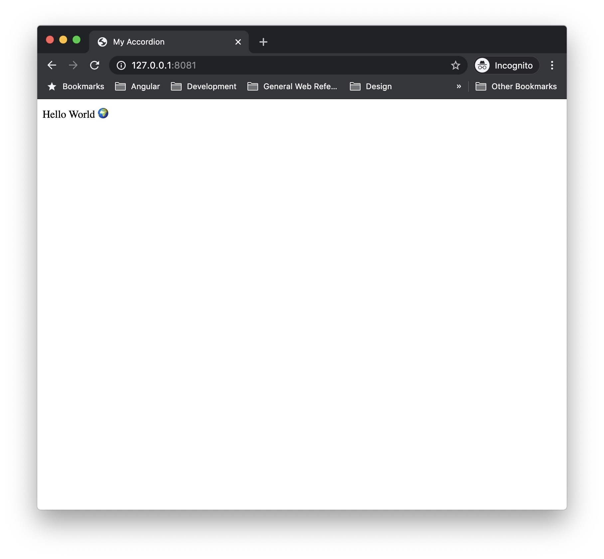
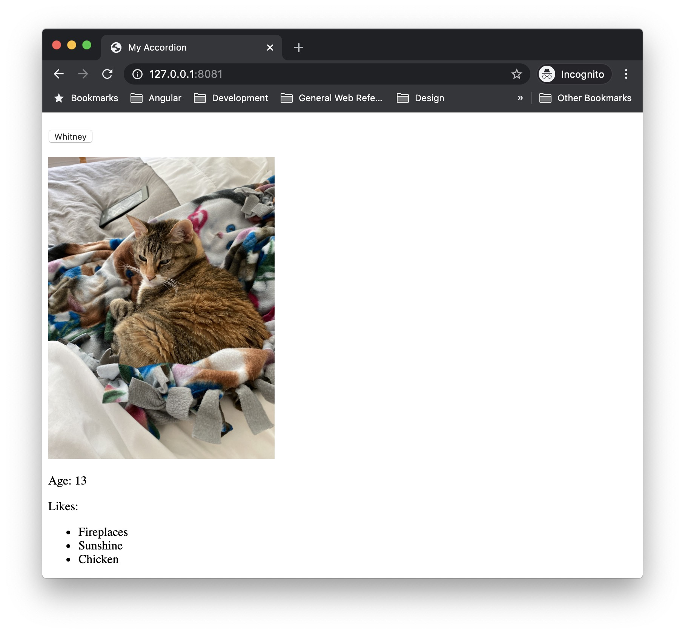
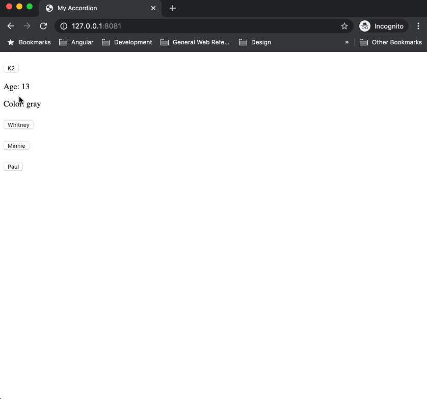

Last spring, I worked on a project where we supplied static content from a WordPress site to a React app via the REST API, which seems like a fairly common use case for the WP REST API. The challenge we faced in this project was that the content from the WordPress site included a carousel&mdash;an interactive component.

Creating a content block to add a carousel to a standard WordPress page is no problem. We can detect when the block is used, and enqueue the JavaScript (JS) required for the carousel's interactivity. But when that same carousel is saved to the WP REST API, only the markup for the carousel is available. Replicating the carousel's functionality in a JS application becomes more challenging.

One approach is to try loading the same script used in the original block. This _can_ work, but if you need to fire events on `load`, you quickly find yourself dealing with race conditions and non-functional components.

Another option is to expose content block data to your REST API. An issue with this approach is that that data for core blocks (e.g. `core/paragraph`), isn't always stored independently of the markup. See `innerContent` in the code below:

```json
{
  "blocks": [
    {
      "blockName": "core/paragraph",
      "attrs": [],
      "innerBlocks": [],
      "innerHTML": "\n<p>This is an example page. It's different from a blog post because it will stay in one place and will show up in your site navigation (in most themes). Most people start with an About page that introduces them to potential site visitors. It might say something like this:</p>\n",
      "innerContent": [
        "\n<p>This is an example page. It's different from a blog post because it will stay in one place and will show up in your site navigation (in most themes). Most people start with an About page that introduces them to potential site visitors. It might say something like this:</p>\n"
      ]
    }
  ]
}
```

Folks who've built WP content blocks know that they use React under the hood. This is great, but if your JS application is build in Angular or Vue, you'll end up building your custom content blocks twice.

[Web components](https://developer.mozilla.org/en-US/docs/Web/Web_Components) offer an enticing solution to this problem. Web components allow developers to create custom elements (i.e. HTML elements), that encapsulate their own styles and JS.

In this post, I'll walk through building an interactive web component, creating a content block with the component, and finally, how to pull everything together in a simple React example that calls a WP REST API endpoint.

## Building a web component

Building a web component requires a decent amount of JS knowledge. DOM expertise is a must, comfort with [ES2015 classes](https://developer.mozilla.org/en-US/docs/Web/JavaScript/Reference/Classes) is important, and you will need to know a few Array methods including [`map()`](https://developer.mozilla.org/en-US/docs/Web/JavaScript/Reference/Global_Objects/Array/map) and [`Array.from()`](https://developer.mozilla.org/en-US/docs/Web/JavaScript/Reference/Global_Objects/Array/from).

You won't need extensive command line experience for this tutorial, but you will need to run a few commands. With all this said, let's define what we're building.

To demonstrate how web components can handle interactivity, we're going to build an accordion component. Here are the requirements for our accordion:

- allow a user to expand & collapse panels
- have an option to determine whether one panel is open at a time, or if several can be open
- use accessible markup
- support keyboard users

### Spinning up the accordion project

We'll start the accordion component by creating a new directory and initializing a new `npm` project.

```bash
mkdir my-accordion
cd my-accordion
npm init
```

Follow the prompts on the screen to initialize your `npm` project.


Next, install Lit Element.

```bash
npm install lit-element
```

As the site states, [Lit Element](https://lit-element.polymer-project.org/) is &ldquo;a simple base class for creating fast, lightweight web components,&rdquo; that makes spinning up new web components super easy. It offers utilities for easily styling web components, creating component templates, and lifecycle hooks for updating your web component.

Before proceeding to the next step, review the [Lit Element starting guide](https://lit-element.polymer-project.org/guide/start) to setup your environment to use Lit Element locally. Most importantly, you should make sure you have the [`polymer-cli`](https://www.npmjs.com/package/polymer-cli) installed.

Now that we have Lit Element set up, let's add some new files to our project. We will need a JS file, an HTML file, and I think it's a good idea to document as we go, so let's include a markdown file for our readme. Also include a `.gitignore` file if you plan to push your project to a remote Git server. The project structure should look something like this:

```
.
├── node_modules
├── .gitignore
├── index.html
├── index.js
├── package-lock.json
├── package.json
└── README.md
```

Now that our project is spun up, we're ready to start coding.

### Scaffolding a basic component

Let's start by having our component simply output &ldquo;Hello World&rdquo;. We'll start by adding some code in `index.js`:

```js
// index.js
import { LitElement, html } from 'lit-element';

class MyAccordion extends LitElement {
  render() {
    return html`
      Hello World 🌍
    `;
  }
}

customElements.define('my-accordion', MyAccordion);
```

The `render` method returns our component's HTML template. The `html` function is simply a wrapper for creating the template. `customElements.define()` allows us to define a name for our web component, and associate the extended `LitElement` class to this tag.

<cf-alert type="warning">
  All custom elements (i.e. web components) must use hyphenated names to avoid conflicting with existing HTML elements.
</cf-alert>

Now that the web component is defined, we're ready to use it in our HTML. Let's add a basic HTML5 scaffold to `index.html` adding our web component script, and placing an instance of our custom element in the `body`:

```html
<!-- index.html -->
<!DOCTYPE html>
<html lang="en">
  <head>
    <title>My Accordion</title>
    <script type="module" src="index.js"></script>
  </head>
  <body>
    <my-accordion></my-accordion>
  </body>
</html>
```

The `script` tag imports the `index.js` file where we defined our new web component. We added `type="module"` because we're using [JS modules](https://developer.mozilla.org/en-US/docs/Web/JS/Guide/Modules) in this project (e.g. `import { LitElement, html } from LitElement;`).

`<my-accordion></my-accordion>` is what actually outputs our new web component to the screen. If you kick off `polymer serve` in your terminal, and visit the link, you should see our new web component. 🎉



We've taken our first step to creating a web component, by creating a component that outputs static text, but now it's time to get into building our accordion.

### Adding the accordion template

First, we'll update the `render` method and replace `Hello World 🌍` with a `slot`.

```js
// index.js
import { LitElement, html } from 'lit-element';

class MyAccordion extends LitElement {
  render() {
    return html`
      <slot></slot>
    `;
  }
}

customElements.define('my-accordion', MyAccordion);
```

A `slot` is like a placeholder for other content in a component. In this case, we've left our `slot` unnamed, but you can name slots to have specific areas for your component's content. At this point, this is all we need the accordion file to do. We'll use this component as a wrapper for our &ldquo;panels&rdquo;, and actually output our content in a separate web component.

Let's go ahead and create a new JS file called `panel.js`. Following the [WAI-ARIA Authoring Practices](https://www.w3.org/TR/wai-aria-practices-1.1/) for accordions, we'll do our best to ensure our panel template uses semantic markup and ARIA attributes appropriately.

We'll start by filling out the HTML template. Because I care about accessibility, I am going to follow the [WAI-ARIA Authoring Practices](https://www.w3.org/TR/wai-aria-practices-1.1/) for my accordion.

```js
import { LitElement, html } from 'lit-element';

class MyAccordionPanel extends LitElement {
  render() {
    return html`
      <h3>
        <button
          id="button1"
          type="button"
          aria-expanded="true"
          aria-controls="panel1"
        >
          Whitney
        </button>
      </h3>
      <div id="panel1" role="region" aria-labelledby="panel1">
        
        <p>Age: 13</p>
        <p>Likes:</p>
        <ul>
          <li>Fireplaces</li>
          <li>Sunshine</li>
          <li>Chicken</li>
        </ul>
      </div>
    `;
  }
}

customElements.define('my-accordion-panel', MyAccordionPanel);
```

We can quickly test the panel behaves as expected. First, add the following line to `index.js`:

```js
import './panel';
```

Then add an instance of the panel inside your `my-accordion` element in `index.html`:

```html
<!-- index.html -->
<my-accordion>
  <my-accordion-panel></my-accordion-panel>
</my-accordion>
```

Now if we refresh the browser, we should see our updated web component with the `my-accordion-panel` component.



This is a good start, but we want to allow users to add their own content to `my-accordion-panel`. The easiest change to start making the component more flexible is to replace the content within the `div` with a `slot`. Next, we'll want to introduce properties to handle the button text and panel state.

```js
import { LitElement, html } from 'lit-element';

class MyAccordionPanel extends LitElement {
  constructor() {
    super();

    this.label = '';
    this.expanded = false;
  }

  static get properties() {
    return {
      label: { type: String },
      expanded: { type: Boolean }
    };
  }

  expand() {
    return (this.expanded = !this.expanded);
  }

  kebabCase(string) {
    return string.replace(/\s/g, '-').toLowerCase();
  }

  render() {
    return html`
      <h3>
        <button
          id="${this.kebabCase(this.label)}-button"
          type="button"
          .aria-expanded="${this.expanded}"
          aria-controls="${this.kebabCase(this.label)}-panel"
          @click="${() => this.expand()}"
        >
          ${this.label}
        </button>
      </h3>
      <div
        id="${this.kebabCase(this.label)}-panel"
        role="region"
        aria-labelledby="${this.kebabCase(this.label)}-button"
        .hidden="${!this.expanded}"
      >
        <slot></slot>
      </div>
    `;
  }
}

customElements.define('my-accordion-panel', MyAccordionPanel);
```

The first thing we're doing is setting up the class `constructor`. Because the panel class extends LitElement, we need to call `super()`, then we can add and set default values for the properties we want to use, `label` and `expanded`.

Next, we set up the `properties` getter from LitElement. Properties are useful because LitElement will always be listening for changes to properties, and will update our component appropriately when changes are detected. In this instance, we doing two things when call the `properties` getter:

1. Declare the properties we're going to use in the component.
1. Convert the property type.

There's a bit of nuance when thinking about converting the property type, so let's look at an example.

Our `button` has an `aria-expanded` attribute, and when we set this attribute, we expect it to be either `aria-expanded="true"` or `aria-expanded="false"`. HTML attributes are always represented as strings regardless of whether they are boolean values (as in this case), or not. By using the `properties` getter, we can tell LitElement that when we're working with `expanded` in the pure JS, we expect it to be converted to a boolean, but when it's used in the HTML template it's converted to a string.

After setting up the `properties` getter, we have a method to handle updating the state of `expanded`, and a helper method, `kebabCase`, that will make it easier to create unique IDs for the panels in the HTML.

Finally, the `render` method has been updated to use the newly defined properties. You may notice that `aria-expanded` and `hidden` both have a `.` prepended to them. The `.` tells LitElement to bind that attributes property to one of our declared properties so it renders correctly in the HTML.

Now we can update the content of `my-accordion` in `index.html`.

```html
<!-- index.html -->
<my-accordion>
  <my-accordion-panel label="K2" expanded="true">
    <p>Age: 13</p>
    <p>Color: gray</p>
  </my-accordion-panel>
  <my-accordion-panel label="Whitney">
    <p>Age: 13</p>
    <p>Color: orange</p>
  </my-accordion-panel>
  <my-accordion-panel label="Minnie">
    <p>Age: 4</p>
    <p>Color: gray</p>
  </my-accordion-panel>
  <my-accordion-panel label="Paul">
    <p>Age: 3</p>
    <p>Color: orange</p>
  </my-accordion-panel>
</my-accordion>
```

Here, you'll see that we're using `label` and `expanded` as attributes. These will be passed down to `my-accordion-panel` as properties.

If you reload the page, you will see a fully-functioning accordion.



### Styling a web component

The basic mechanics of the accordion are fine, but it doesn't look pretty, so in this section we'll focus on adding styles.

We'll start our styles by adding a border around `my-accordion`. To do this, we'll add a `styles` getter to the `MyAccordion` class:

```js
import { LitElement, html, css } from 'lit-element';
import './panel';

class MyAccordion extends LitElement {
  static get styles() {
    return css`
      :host {
        border: 1px solid gray;
        display: block;
      }
    `;
  }

  render() {
    return html`
      <slot></slot>
    `;
  }
}

customElements.define('my-accordion', MyAccordion);
```

We use `:host` here to target the _host_ (i.e. container) of the [shadow DOM](https://developer.mozilla.org/en-US/docs/Web/Web_Components/Using_shadow_DOM). The shadow DOM here being the contents of our HTML template. By default, a host does not have any properties including `display`, so in order to get the `border` to display properly, `display: block` needs to be added.

A border is the only style I want to add to `my-accordion` for now, so let's move onto styling the panel.

```js
import { LitElement, html, css } from 'lit-element';

class MyAccordionPanel extends LitElement {
  constructor() {
    super();

    this.label = '';
    this.expanded = false;
  }

  static get properties() {
    return {
      label: { type: String },
      expanded: { type: Boolean }
    };
  }

  static get styles() {
    return css`
      :host {
        display: block;
        padding: 1rem;
      }

      h3 {
        margin: 0;
      }

      button {
        background-color: transparent;
        border: 0;
        display: block;
        font-size: 1rem;
        padding: 0;
        text-align: left;
        width: 100%;
      }

      div {
        margin-top: 1rem;
      }
    `;
  }

  expand() {
    return (this.expanded = !this.expanded);
  }

  kebabCase(string) {
    return string.replace(/\s/g, '-').toLowerCase();
  }

  render() {
    return html`
      <h3>
        <button
          id="${this.kebabCase(this.label)}-button"
          type="button"
          .aria-expanded="${this.expanded}"
          aria-controls="${this.kebabCase(this.label)}-panel"
          @click="${() => this.expand()}"
        >
          ${this.label}
        </button>
      </h3>
      <div
        id="${this.kebabCase(this.label)}-panel"
        role="region"
        aria-labelledby="${this.kebabCase(this.label)}-button"
        .hidden="${!this.expanded}"
      >
        <slot></slot>
      </div>
    `;
  }
}

customElements.define('my-accordion-panel', MyAccordionPanel);
```

It might be alarming to see no classes used in the styles, but the neat thing about web components and the shadow DOM is that we can use element selectors in our styles no fear of them being overwritten by styles in our application.

So if adding `button { background-color: hotpink; }` in the application styles doesn't work, how do we update our web components' styles from our application?

#### Creating theme-able components with custom properties

## Creating a block

```js
const { registerBlockType } = wp.blocks;
const { __ } = wp.i18n;

registerBlockType('my-blocks-accordion/my-blocks-accordion', {
  title: __('Alcatraz Blocks Accordion', 'my-blocks-accordion'),
  category: 'widgets',
  supports: {
    html: false
  },
  edit: () => (
    <my-accordion>
      <my-accordion-panel label="K2" expanded="true">
        <p>Age: 13</p>
        <p>Color: gray</p>
      </my-accordion-panel>
      <my-accordion-panel label="Whitney">
        <p>Age: 13</p>
        <p>Color: orange</p>
      </my-accordion-panel>
    </my-accordion>
  ),
  save: () => (
    <my-accordion>
      <my-accordion-panel label="K2" expanded="true">
        <p>Age: 13</p>
        <p>Color: gray</p>
      </my-accordion-panel>
      <my-accordion-panel label="Whitney">
        <p>Age: 13</p>
        <p>Color: orange</p>
      </my-accordion-panel>
    </my-accordion>
  )
});
```

```php
<?php
/**
 * Plugin Name:     Alcatraz Blocks Accordion
 * Plugin URI:      https://github.com/carrieforde/my-blocks-accordion.git
 * Description:     A simple plugin scaffold for a WP Content Block.
 * Author:          carrieforde
 * Author URI:      https://carrieforde.com
 * Text Domain:     my-blocks-accordion
 * Domain Path:     /languages
 * Version:         1.0.0
 *
 * @package         Block_Scaffold
 */

// Your code starts here.
add_action( 'init', 'alcatraz_blocks_accordion_init' );
/**
 * Registers all block assets so that they can be enqueued through Gutenberg in
 * the corresponding context.
 *
 * @see https://wordpress.org/gutenberg/handbook/designers-developers/developers/tutorials/block-tutorial/applying-styles-with-stylesheets/
 */
function alcatraz_blocks_accordion_init() {
	// Skip block registration if Gutenberg is not enabled/merged.
	if ( ! function_exists( 'register_block_type' ) ) {
		return;
	}

	$index_js = 'dist/my-blocks-accordion-block.js';
	wp_register_script(
		'my-blocks-accordion-editor',
		plugins_url( $index_js, __FILE__ ),
		array(
			'wp-blocks',
			'wp-i18n',
			'wp-element',
		),
		'1.0.0',
		false
	);

	register_block_type(
		'my-blocks-accordion/my-blocks-accordion',
		array(
			'editor_script' => 'my-blocks-accordion-editor',
		)
	);
}

add_action( 'wp_enqueue_scripts', 'alcatraz_blocks_accordion_enqueue_scripts' );
/**
 *  Enqueue front end scripts.
 */
function alcatraz_blocks_accordion_enqueue_scripts() {
	if ( has_block( 'my-blocks-accordion/my-blocks-accordion' ) ) {

		$index_js = 'dist/my-blocks-accordion-component.js';

		wp_enqueue_script(
			'my-blocks-accordion-component',
			plugins_url( $index_js, __FILE__ ),
			array(),
			'1.0.0',
			false
		);
	}
}

add_filter( 'script_loader_tag', 'alcatraz_blocks_accordion_script_attributes', 10, 2 );
/**
 * Modify script attributes.
 */
function alcatraz_blocks_accordion_script_attributes( $tag, $handle ) {
	if ( 'my-blocks-accordion-component' !== $handle ) {
		return $tag;
	}

	return str_replace( "type='text/JS' src", ' type="module"  async src', $tag );
}
```

```js
const { registerBlockType } = wp.blocks;
const { Fragment } = wp.element;
const { InnerBlocks, InspectorControls } = wp.editor;
const { ToggleControl, PanelBody } = wp.components;
const { __ } = wp.i18n;

// import "./panel";

registerBlockType('my-blocks-accordion/my-blocks-accordion', {
  title: __('Alcatraz Accordion', 'my-blocks-accordion'),
  category: 'widgets',
  supports: {
    html: false
  },
  attributes: {
    multiPanel: {
      type: 'boolean',
      default: false
    }
  },
  edit: ({ attributes, setAttributes, isSelected }) => {
    const { multiPanel } = attributes;
    const onToggleChange = () => setAttributes({ multiPanel: !multiPanel });
    return (
      <Fragment>
        {isSelected && (
          <InspectorControls>
            <PanelBody title="Multi-panel">
              <ToggleControl
                label="Allow multiple panels to be open?"
                help={
                  multiPanel ? 'Multiple panels allowed' : 'Single panel only'
                }
                checked={multiPanel}
                onChange={onToggleChange}
              />
            </PanelBody>
          </InspectorControls>
        )}
        <my-accordion multiPanel={multiPanel}>
          <my-accordion-panel label="K2" expanded="true">
            <p>Age: 13</p>
            <p>Color: gray</p>
          </my-accordion-panel>
          <my-accordion-panel label="Whitney">
            <p>Age: 13</p>
            <p>Color: orange</p>
          </my-accordion-panel>
        </my-accordion>
      </Fragment>
    );
  },
  save: () => (
    <my-accordion>
      <my-accordion-panel label="K2" expanded="true">
        <p>Age: 13</p>
        <p>Color: gray</p>
      </my-accordion-panel>
      <my-accordion-panel label="Whitney">
        <p>Age: 13</p>
        <p>Color: orange</p>
      </my-accordion-panel>
    </my-accordion>
  )
});
```
