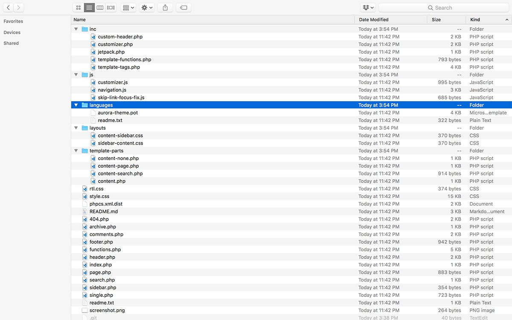
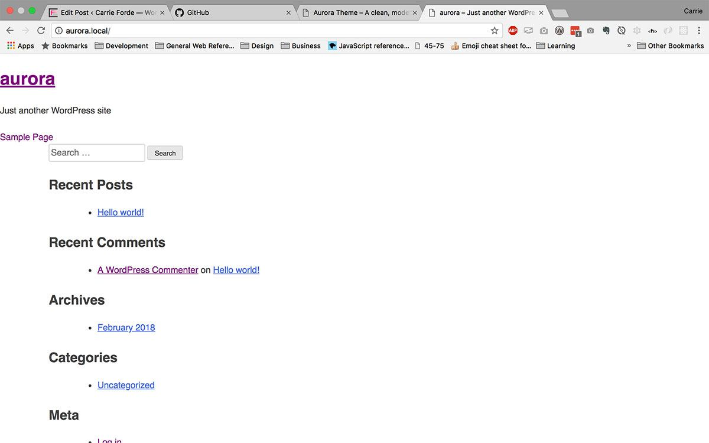

---

title: 'Building a theme vs. a decoupled front end
'
category: 'WordPress'
date: 2018-02-26
---

Today is the day we start talking about dev shit™, and start getting into the nitty gritty of building [Aurora Theme](https://github.com/carrieforde/Aurora-Theme). In the [project plan](http://staging.carrieforde.flywheelsites.com/building-react-powered-starter-theme/), I laid out the benefits of using the REST API, and that one of those benefits is that we can break out of the whole theme paradigm. But, I’ve chosen not to decouple my front end and, instead, am building a React-powered theme. And you may be wondering why I’ve chosen to do this. Well, let’s remember this nugget from the project plan:

> Aurora will finally make REST API-driven sites and technology more accessible to the everyday WordPress user and developer.

I strongly believe the best way to make the REST API more accessible to the everyday WordPress user is to build the front end using the current theme paradigm. Let’s face it, the current system of changing the look of one’s site is pretty damn nifty. And we can take customization further by adding options to the customizer.

But the beauty is that Aurora Theme could just as easily be repurposed as a decoupled theme. Just take out the PHP and WordPress-specific bits, and you’re left with a decoupled app.

## Determining file requirements

Even though Aurora Theme is mean to be a starter theme, it’s still going to be an attractive, functional theme. And I have every intention of submitting it to the theme repository, so it’s important to understand up front what the requirements must be met. According to the [WordPress Theme Developer Handbook](https://developer.wordpress.org/themes/release/required-theme-files/), themes submitted to the theme repository must contain the following files:

- style.css
- index.php (as a fallback if all other files fail)
- comments.php
- screenshot.png

Interestingly, [Foxhound](https://github.com/ryelle/Foxhound), which is also a React-powered theme, doesn’t have the comments.php template, but it does have the other files. So following their lead, I think I’ll include the above, minus comments.php, and add the following:

- functions.php (for managing script & style enqueues, and - some other functionality)
- header.php (for all the stuff that lives in <head />)
- footer.php (for all the scripts that come before the - closing <body />)
- inc/
  - customizer.php
  - rest-api.php (waffling on this, but I think I’ll need to make a few tweaks to endpoints)
  - template-tags.php (maybe?)

## Building a foundation with Underscores

To give myself a head start, I’m using Underscores as the foundation for Aurora. [Underscores](http://underscores.me/) doesn’t look like much from the start, but it’s packed with a lot of stuff, and it will save me time enqueuing things, getting the file structure set up, and getting a theme that looks like a theme.

Before: Aurora with the full set of files from Underscores

Before: Aurora home page with full Underscores

But as you can see from the file structure screenshot, there are a lot of files. So first things, first, buh-bye to all the stuff we don’t need.

After: Aurora with only the files we need to start.

Ah, that’s better. Less cruft to cut through to get started, and I didn’t completely break the theme.

After: Aurora homepage after removing a bunch of files.

Clearly, obliterating the `template-parts/` directory prevents any content from loading, but that’s fine. We’ll replace it with JavaScript soon enough.

## Cleaning up what’s left

There is still a lot of PHP-specific theme stuff hanging out that won’t be necessary for this project. I tried to handle this in a semi-methodical way:

1. Clean up `functions.php`

   - Add theme constants to save on cognitive load / extra typing
   - Add a social menu for eventually managing social media links
   - General code cleanup / rearranging

1. Remove a bunch of unneeded functionality

   - Wipe `template-tags.php` completely clean (jury’s out on whether I need this file at all)
   - Clean up the customizer file

1. Blast away a bunch of markup & templating in `header.php`, `index.php`, and `footer.php`

   - Since this is a JS theme, we’ll let React handle the markup and templating for those sections

Since everything above left me with a literal blank canvas, I added a temporary JavaScript header. It just creates a header tag, an `h1` for the title, and a `p` for the tagline, brings everything together, and slaps it into the DOM. I also discovered at this point that I was a little overzealous with my clean up and accidentally removed `get_footer()` from `index.php`, which is responsible for footer scripts and pulling in the admin bar.

Integrating Aurora Core is next on the list. I’m really looking forward to sharing a bit about that project and wrestling Webpack to work with WordPress.
